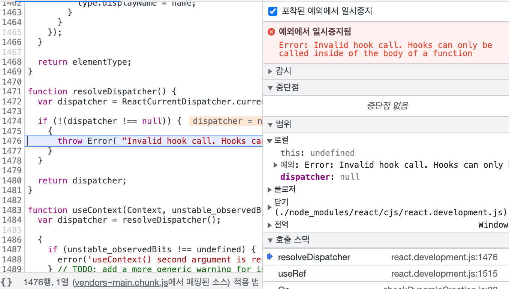

요즘 React로 이것저것 만들어보기 시작했다. 그러다 만나게 된 Error가 생겼다. 그런데 Error가 일관적으로 발생하는 것이라면 납득이 될텐데 조금 이상한 경우라서 기록을 하기로 했다. 먼저 Error 발생의 원인을 찾은 순서와 해결한 방법을 이야기하려고 한다. 그 다음에 Invalid Hook Call이 무엇인지 그리고 React 공식 문서에서는 어떤 해결책을 제시하고 있는지 마지막에 기록했다.

## 컴퓨터에 따라 Error가 나왔다 안나왔다.

나는 두 대의 컴퓨터를 사용한다.

> Apple Macbook Air M1  
> Apple iMac Intel

1.  문제

    - M1에서 계속 Invalid 에러가 발생했다.
    - 처음 Create React App으로 개발 환경을 세팅했을 때는 오류가 발생하지 않았기 때문에 패키지에서 발생하는 오류라고 추론했다.
    - 패키지를 하나씩 지우면서 Styled-Components, createGlobalStyle을 사용할 경우에 오류가 발생했다.

2.  이상한 점

    - 집에와서 IMac으로 개발 환경을 변경했다. 그런데 Error가 발생하지 않았다.
    - styled components의 버전은 똑같다.

3.  시도한 것들

    - [React 공식 문서]("https://ko.reactjs.org/warnings/invalid-hook-call-warning.html")에서 제시하는 방법(3가지 방법 다 이상 없었음)
    - Node 버전 통일
    - brew, nvm 재설치
    - [React setting from scratch](https://javascript.plainenglish.io/create-a-react-app-from-scratch-in-2021-8e9948602e9c)
    - styled components 공식 문서에서 createGlobalStyle 부분 읽어보기(딱히 이상 없음)
    - [stlyed components github issue](https://github.com/styled-components/styled-components/issues/3045)

4.  해결?

    - Styled Components의 버전을 4.x.x로 낮추니까 M1에서 더이상 Error가 발생하지 않았다.
    - 왜 이런 버그가 발생하는지 알 수 없었다. 단지 버전을 낮추니까 됐다면 Styled-components 패키지의 종속성 버그일 가능성이 있다. 하지만 intel mac에서는 똑같은 버전의 node에서 Error가 발생하지 않기 때문에 종속성 버그가 아닐수 있다. 딱히 M1에서만 Invalid Hook Error가 발생하지 않는 것 같다. issue에는 intel에서도 이런 에러가 발생한다. 하지만 공통적인 원인은 Styled-components의 버전이 +5일 경우에 에러가 발생한다.

5.  해결은 했지만 결론은 나지 않았다.
    - 해결 방법이 마음에 들지 않는다.

## Invalid Hook Call

Invalid Hook Call은 3가지 원인 때문이라고 한다.

1. React와 React DOM의 버전이 일치하지 않을 수 있습니다.
2. Hooks 규칙을 위반했을 수 있습니다.
3. 같은 앱에 React가 한 개 이상있을 수 있습니다.

해결책은 https://ko.reactjs.org/warnings/invalid-hook-call-warning.html에서 볼 수 있다.
