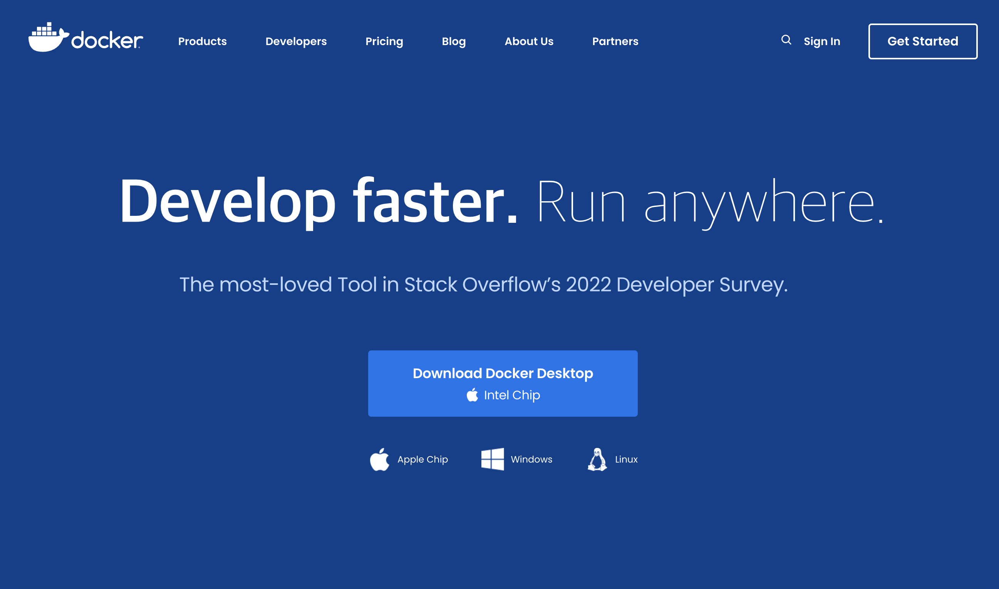
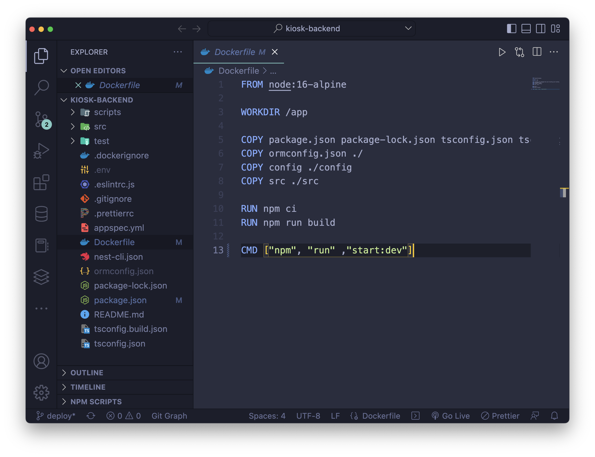
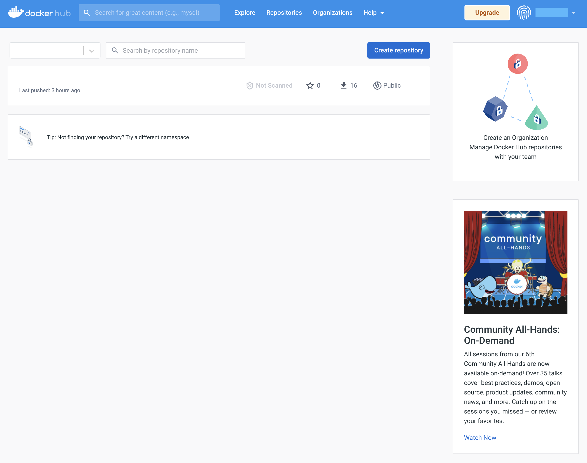
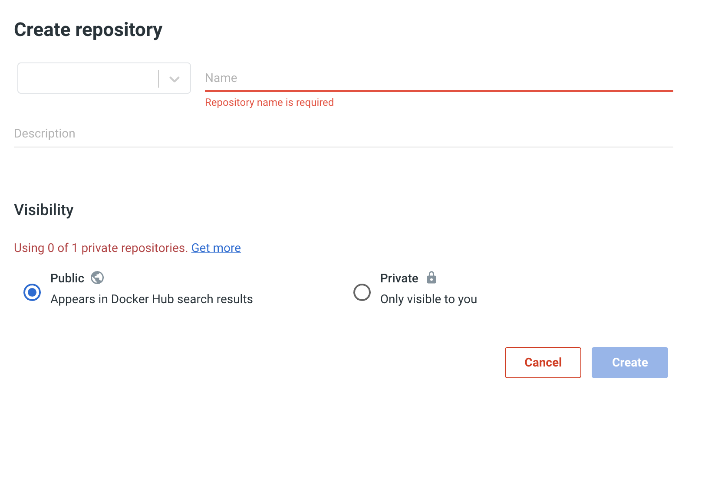
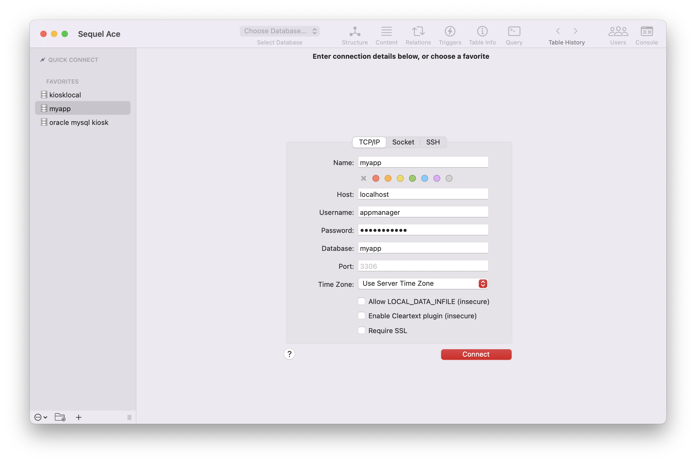
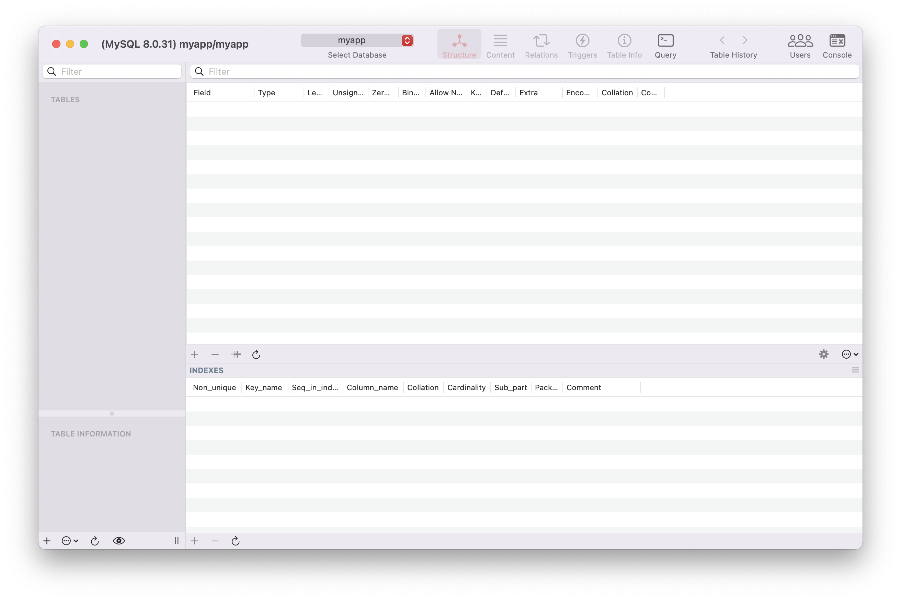
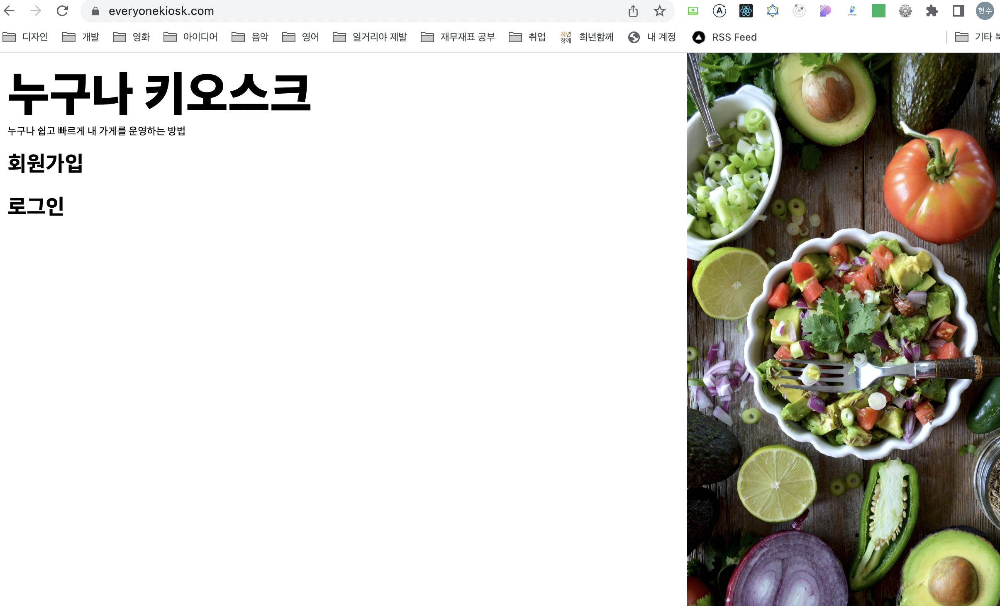

몇 주전 늦은 저녁 개발을 하고 있었다. 그런 중 문자가 왔다. 보낼 사람이 없는데 하고 확인을 해보니 문자를 보낸 그대는 AWS. 요금 통지서였다. '뭐야 프리티어가 끝났어?' 하고 요금을 보는데 4만원 가량이 빠져나갔다. 취준생인 나로써 4만원은 적은 돈이 아니다. 갑자기 밀려오는 스트레스...
팀 프로젝트로 고생해서 만들었지만 동작하지 않는 어플리케이션이었다. 프로젝트가 끝나자마자 배포가 갑자기 내 몫이 되어서 강제로 일주일 넘게 고생해서 겨우 배포를 했다. 새로운 도전이라 생각하며 새벽에 배포를 마치고 새벽 공기를 마시면서 기분 좋게 로그인을 하고 어플리케이션을 동작시켰지만 동작하지 않았다. [build시에 env가 html에 주입 된다](https://create-react-app.dev/docs/adding-custom-environment-variables/)는 사실을 모르고 몇 가지를 프론트에서 코드를 작성해서 넘겼기 때문이었다. 결국 모든게 다 처음이었던 나는 심지어 배포한 어플리케이션이 동작하지 않는 경험조차 처음인 나는 허탈함에 그날 밤을 세우고....

이야기가 삼천포로 빠지려고 한다. 어쨌든 그래서 내가 속해있는 커뮤니티에 도움을 구했다. 여러 답변이 달렸다. (감사합니다.) 글쓰기 모임 리더님이 오라클 클라우드가 무료라고 알려주셨다. EC2에서는 서비스를 중단했음에도 불구하고 0.82 USD가 매일 빠져나가고 있었다. 급하게 서비스를 중단했는데 아차차... 서버에 올렸던거 백업하는거 깜박했다. 아 그때 회고 안썼는데... 결국 그때 썼던 조각 글과 구글링을 바탕으로 다시 처음부터 배포를 해보기로 했다. 뭐 그래도 처음 하는 것보다는 빠르게 할 수 있지 않을까?

이번에 배포할 때 Docker를 사용하기로 한 이유는 Docker 이미지를 한번 떠놓으면 여러 환경에서 동일한 세팅이 가능하다고 보았기 때문이다.

> 내가 도커를 써야겠다고 결심하게 한 영상 둘  
> [도커 한방에 정리 🐳 (모든 개발자들이 배워보고 싶어 하는 툴!) + 실습, 드림코딩](https://www.youtube.com/watch?v=LXJhA3VWXFA)  
> [가장 쉽게 배우는 도커, 얄팍한 코딩사전](https://www.youtube.com/watch?v=hWPv9LMlme8)

이 글은 오라클 클라우드에 배포를 하면서 겪은 경험적인 이야기를 최대한 **미래의 나**에게 도움이 되도록 적기 위해서 노력했다.(미래의 나 보고있나? 작성했으니 책장 치지 말자...)

> **개요**  
> 클라우드 : 오라클 클라우드  
> Server OS : Ubuntu 20.04.4
> Web Server : Nginx 18.x  
> Backend : NodeJS 16.14.2  
> FrontEnd : React 17.0.2

# Oracle Cloud

오라클 클라우드는 AWS, Azure, Heroku 등과 같은 클라우드 컴퓨터 서비스다. 그냥 개념상 서버로 사용할 컴퓨터를 빌려주는 서비스라고 생각하면 된다. 여기에 내가 가입을 하고 빌리고 싶은 컴퓨터를 빌려서 서버를 다른 사람들이 사용 할 수 있는 웹 어플리케이션을 배포를 할 수 있다. 그러니까 이게 얼마나 매력적인것이냐고 한다면 내가 만든 어플리케이션에 다른 사람이 도메인을 입력하고 사용할 수도 있다. 그런데 처음 하면 모르는게 정말 많이 나온다. 그래도 하나 해결하고 에러 만나고 하나 해결하고 에러 만나다보면 결국 어플리케이션을 배포할 수 있다. 도메인을 치고 내 어플리케이션에 접속했을 때 그 기분은... 좋다.

오라클 클라우드는 Cloud Free Tier가 상시 무료다. 무료 기간이 정해져있지 않다. 그래서 숨만 쉬어도 돈이 나가는 AWS에서 옮기기로 했다. 오라클 클라우드 초반 세팅(네트워킹 설정, 인스턴스 설정 등)은 [{Tip&Tech - Linux, MySQL} 오라클 클라우드 무료 서버 사용하기, @시코-시니어코딩](https://www.youtube.com/watch?v=wLgHEn2vcPo)을 보는 것이 좋다. 동영상에서는 CentOS 8으로 OS를 설정하는데 나는 Ubuntu 20.04를 사용하기로 했다.

ssh키를 발급 받았다면 ssh 접속을 하면 된다.

```shell
$ ssh -i '당신의.key' 서버이름@IP주소

// 만약 접속이 실패한다면


$ sudo ssh -i '당신의.key' 서버이름@IP주소
Password: // 당신이 사용하고 있는 데스크탑 비밀번호
// 성공하면 볼 수 있는 메시지
Welcome to Ubuntu 20.04.4 LTS (GNU/Linux 5.15.0-1016-oracle x86_64)
```

일단 처음 해 볼 것은 서버가 잘 구동 되는지 Nginx를 설치해서 알아보면 된다. 일단 보안 설정에서 80, 443, 3306, 33060 등 내가 사용할 포트를 이미 열었을 것이다. Nginx를 설치해보자.

> nginx가 무엇인지 궁금하다면  
> [아파치, NginX, 톰캣이 뭔가요? (+ 웹서버, WAS, 로드밸런싱, 프록시), 얄팍한 코딩사전](https://www.youtube.com/watch?v=Zimhvf2B7Es&t=257s)

## Nginx가 설치 되어있는지 확인해보기

우분투에서는 패키지가 설치 되어 있는지 확인하기 위해서 아래와 같은 명령어를 사용한다.

```shell
// 패키지 목록 전체
$ dpkg -l

// 특정 패키지가 설치되어있는지 확인하기
$ dpkg -l | grep nginx
```

설치가 안되어있다면 패키지를 설치하기 위해서 다음과 같이 입력하면 설치할 수 있다.

```shell
// 업데이트를 한번 해준다. 매번 하지 말고 처음 서버에 들어와서 하면 된다.
$ sudo apt-get update
// nginx를 설치한다.
$ sudo apt install nginx
```

설치가 성공적으로 끝나면 에러처럼 보이는 메시지가 없을 것이다. nginx의 상태를 살펴보자.

```shell
$ systemctl status nginx
● nginx.service - A high performance web server and a reverse proxy server
     Loaded: loaded (/lib/systemd/system/nginx.service; enabled; vendor preset:>
     Active: failed (Result: exit-code) since Thu 2022-10-20 11:37:08 UTC; 3h 4>
       Docs: man:nginx(8)
    Process: 27418 ExecStartPre=/usr/sbin/nginx -t -q -g daemon on; master_proc>
    Process: 27419 ExecStart=/usr/sbin/nginx -g daemon on; master_process on; (>

Oct 20 11:37:07 kiosk nginx[27419]: nginx: [emerg] bind() to 0.0.0.0:80 failed >
Oct 20 11:37:07 kiosk nginx[27419]: nginx: [emerg] bind() to [::]:80 failed (98>
Oct 20 11:37:07 kiosk nginx[27419]: nginx: [emerg] bind() to 0.0.0.0:80 failed >
Oct 20 11:37:07 kiosk nginx[27419]: nginx: [emerg] bind() to [::]:80 failed (98>
Oct 20 11:37:08 kiosk nginx[27419]: nginx: [emerg] bind() to 0.0.0.0:80 failed >
Oct 20 11:37:08 kiosk nginx[27419]: nginx: [emerg] bind() to [::]:80 failed (98>
Oct 20 11:37:08 kiosk nginx[27419]: nginx: [emerg] still could not bind()
Oct 20 11:37:08 kiosk systemd[1]: nginx.service: Control process exited, code=e>
Oct 20 11:37:08 kiosk systemd[1]: nginx.service: Failed with result 'exit-code'.
Oct 20 11:37:08 kiosk systemd[1]: Failed to start A high performance web server
```

systemctl은 우분투에서 패키지를 시작하거나 중단하거나 확인할 때 사용하는 명령어다. 위 메시지는 실패했다는 메시지다. 실패해도 두려워 말고 에러 메시지를 차근차근 읽으면서 해결하면 된다. 처음 서버에 접속해서 처음 nginx의 상태를 살피면 무상태 이거나 서비스가 정상적으로 실행중이라는 메시지를 볼 수 있다.

성공적으로 서비스가 실행중이라면 고정 IP를 주소창에 입력해보자. 그러면 Welcome to nginx!라는 문자를 볼 수 있다. nginx에 내장되어있는 기본 html에서 출력하는 화면이다. 그 밖에 telnet을 설치해서 80 포트가 정상적으로 동작하는지 확인 해 볼 수 있다. nginx가 가장 시각적이라 기분이 좋아져서 예제로 가져와봤다. 다음으로 넘어가기전에 nginx는 중단하자.

```shell
$ systemctl stop nginx
```

## docker 설치하기

> Docker 공식 페이지 Document  
> [Install Docker Engine on Ubuntu](https://docs.docker.com/engine/install/ubuntu/)

공식 페이지에 docker를 실행시키는 방법이 `service docker start`로 나오는데 `service`가 동작이 안되는 사람은 `systemctl start docker`로 하면 된다.

## 메모리 스왑(선택사항이라고 쓰고 어쩔수 없이 필수)

오라클 클라우드 상시 무료 컴퓨터는 1G의 메모리를 가지고 있다. 그래서 docker container를 몇 개 실행 하다보면 컴퓨터가 멈춰 버린다. 그래서 메모리 스왑을 해서 사용해야한다. 성능 저하가 발생할 수 있다고 하는데 아마도 큰 영향이 없을 것이다. 아래 블로그 포스팅에서 잘 설명되어있으니까 보고 따라하면 된다. 스왑 용량은 자기가 지정하기 나름인데 나는 4G를 했다.

> 참고  
> [[Tip] Ubuntu 20.04 Swap 메모리 설정하기, FacerAin](https://facerain.club/swap-memory/)

# Docker 이미지 만들기

Docker는 컨테이너로 리눅스 응용 프로그램을 실행 시키는 방법이다. 각 컨테이너가 격리된 환경에서 실행된다. 또한 컴퓨터의 리소스를 컨테이너가 공유해서 사용한다. 각 컨테이너는 격리된 공간 안에서 여러가지 일을 할 수 있기 때문에 서버를 셋업하다가 꼬여서 처음부터 다시 하는 일을 예방할 수 있다. 무엇보다 도커 이미지를 사용하면 여러 서버에서 동일하게 배포가 가능하다. 처음에는 '뭔 말이여?' 할 수도 있다. 직접 사용해보면 감이 온다. 지금은 도커를 '왜 진작 사용하지 않았지?'라는 생각이 든다.

cli로도 설치할 수 있지만 나는 [Docker](https://www.docker.com/) 공식 페이지에서 내 OS에 맞는 도커 데스크탑 어플리케이션을 다운 받았다. 이게 편하다.



설치가 끝나면 docker cli도 사용이 가능하다.

## Dockerfile

도커 이미지를 만들어야할 환경에서 Dockerfile을 만들자. 만들고 나면 위의 이미지처럼 고래 모양 아이콘을 가진 Dockerfile이 만들어진다.



도커 파일을 작성해보자.

```docker
FROM node:16-alpine

WORKDIR /app

COPY package.json package-lock.json ./
COPY src ./src

RUN npm ci
RUN npm run build

CMD ["npm", "run" ,"start:dev"]
```

### FROM

제일 처음은 항상 FROM baseImage로 시작해야한다. 내가 사용하려는 node는 이미지가 제공되고 있다. 이미지에는 node 아래에 밑줄이 그어저있는데 cmd를 누르고 클릭하면 docker에서 제공하고 있는 reference 볼 수 있다. 내가 실행하고 있는 node 환경에 맞게 설정을 해주면 된다. alpine은 최소단위의 리눅스 버전을 말한다.

### WORKDIR

WORKDIR은 **도커 이미지 안에서** 어떤 경로에서 실행을 할 것인지 작성하는 공간이다. 대부분의 예제에서는 /app이라고 적혀있지만 내가 원하면 /hi나 /hello /gotohell과 같은 것도 가능하다. 처음에 이게 이해가 안되서 내가 사용하는 컴퓨터 루트 디렉토리에 app 폴더가 생성된 줄 알고 이잡듯이 뒤적거렸던 기억이 있다. 하지만 이 경로는 **도커 이미지 안**의 경로다.

### COPY

COPY는 현재 내 프로젝트에서 파일, 폴더를 복사해서 이미지 경로 안으로 가져오는 명령어다.

```docker
COPY <프로젝트에서 복사할 파일이나 폴더> <WORKDIR을 기준으로 복사할 위치>

// package.json 파일을 /app의 root 경로에 복사 하겠다는 의미
COPY package.json ./
```

COPY는 가장 자주 바뀌는 것을 가장 나중에 적는 것이 좋다. docker가 이미지를 만들 때 레이어로 만들기 때문인데 사실 설명을 들어도 잘 알아먹기 어렵다. 도커 파일을 여러번 변경하다 보면 build를 할 때 이게 무슨 소린지 이해하게 된다.

### RUN

docker에서 이미지를 만들 때, 실행하는 명령어를 입력한다.

### CMD

이미지를 다 만들고 나서 실행할 커맨드 명령어를 입력한다.

도커 파일을 다 작성했다. 도커를 빌드하기 전에 .dockerignore를 작성해준다. 도커 이미지를 만들 때, 이미지에 포함되지 않아야 할 파일 이름을 입력해줄 수 있다. .gitignore를 사용해봤다면 익숙할 것이다.

```docker
// .dockerignore
node_modules
```

## docker 이미지 만들기

이렇게 작성하고 나면 빌드를 하면 된다.

```shell
$ docker build -t my-app:1.0 .

Use 'docker scan' to run Snyk tests against images to find vulnerabilities and learn how to fix them
```

빌드를 할 때 -t 다음에 docker의 이미지 이름을 붙이고 : 다음에는 버전 정보를 넣으면 된다. 만약 생략하면 latest가 버전 이름이 된다.

빌드에 성공하면 Use 'docer scan' 메시지를 볼 수 있다. 실패하면 왜 실패했는지 에러가 출력 된다. 빌드가 다 된 도커 파일을 실행을 해볼 수 있다.

## 생성된 docker 이미지 실행하기

```shell
$ docker run --name app -d -p 3000:3000 my-app:1.0
```

--name은 실행 되고 있는 도커의 별명을 붙인다고 생각하면된다. 실제 이미지 이름은 엄청 길 수 있는게 간단하게 별명을 붙여서 커맨드 관리를 쉽게 할 수 있다. -d는 백그라운드에서 계속 실행하는 것을 의미한다. -p는 로컬 컴퓨터와 이미지간에 연결할 포트 번호를 입력하면 되는데 만약 3000:3000이라고 입력하면 컴퓨터 포트 3000번과 이미지 포트 3000을 연결한다는 의미다. 마지막에는 실행할 이미지 이름과 버전 정보를 입력하면 된다.

그럼 정상적으로 도커 이미지가 실행 되고 있는지 확인해보자.

```shell
$ docker ps

CONTAINER ID   IMAGE     COMMAND   CREATED   STATUS    PORTS     NAMES

```

ps 명령어만 치면 현재 실행되고 있는 이미지만 출력된다. 아무것도 실행되고 있지 않으면 위처럼 테이블 헤더만 보인다.
성공하면 실행되고 있는 이미지 정보가 보인다.

```shell
1e8d9496a609   my-app:1.0   "docker-entrypoint.s…"   3 seconds ago   Up 2 seconds   0.0.0.0:3200->3200/tcp   app
```

실행된 docker 이미지의 log를 보고 싶다면 아래 명령어와 같이 입력한다.

```shell
$ docker logs app
```

그럼 실행되고 있는 이미지의 로그 기록을 볼 수 있다. 만약에 도커 이미지가 mysql이나 ubuntu라면 bash로 접속하는 등의 일을 할 수 있다.

```shell
$ docker exec -it app ls
```

위의 명령어는 실행되고 있는 도커 컨테이너의 파일을 확인해보는 명령어를 입력 한 것이다.

```shell
$ docker exec -it ubuntu bash
```

이런 식으로 bash로 접속해서 터미널에서 추가 설정을 하는 것도 가능하다.

## docker 이미지 docker hub에 업로드 하기

docker 이미지가 정상적으로 동작하는 것을 확인 했다면 이제 docker hub에 이미지를 올리면 된다. 다른 여러가지 방법이 존재한다고 하는데 여기선 생략 하겠다. 필요할 때 찾아서 하면 될 것 같다.

docker에 로그인을 하면 docker hub에 접속할 수 있다.



여기에서 create repository 버튼을 누르면 레포지토리를 만들 수 있다.



만들고 나면 내 아이디 옆에 레포지토리 이름이 생긴다. 아이디가 qq1234 레포지토리 이름이 myapp이면 qq1234/myapp으로 생성됐을 것이다. 그럼 이제 hub에 push를 할 준비를 마쳤다. 터미널에서 다음 명령어를 입력해보자.

```shell
$ docker tag my-app:1.0 qq1234/myapp:1.0
```

위 명령어는 내가 생성한 이미지 이름을 내 저장소의 이름과 일치시키는 작업을 하는 것이다. 이렇게 해야 push가 된다고 한다.

그럼 버전 이름까지 다 했으니까 push를 해보자.

```shell
$ docker push qq1234/myapp:1.0
```

push가 정상적으로 끝나면 hub 레파지토리 안에서 qq1234/myapp:1.0 이미지를 확인할 수 있다.

## docker 이미지 서버에서 불러와서 실행하기

이제 거의 마지막이다. docker hub의 이미지를 위에서 만든 ubuntu 컴퓨터에서 불러오면 된다. ssh 접속을 한 뒤에 다음과 같이 명령어를 입력한다.

```shell
$ docker pull qq1234/myapp:1.0
```

그럼 오라클 클라우드 컴퓨터에 내가 올린 도커 이미지를 가져온다. 잘 가져왔는지 확인해보자.

```shell
$ docker images -a
```

가져온 이미지의 이름과 버전 정보를 확인할 수 있다. 마지막으로 위에서 했던 `docker run`을 사용해서 이미지를 실행하고 상태를 확인해보자.

# mysql

mysql도 docker 컨테이너로 격리하려고 한다. 매우 쉽다. mysql 이미지를 가져오면 된다.

> 참조  
> [14.4 Docker를 사용하여 MySQL 설치하고 접속하기](https://poiemaweb.com/docker-mysql)

```shell
// mysql:8.0.23처럼 버전을 지정하지 않으면 가장 최신 버전을 가져온다.
$ docker pull mysql
```

이미지를 가져왔다면 실행하면 된다.

```shell
$ docker run --name mysqlserver -e MYSQL_ROOT_PASSWORD=<your-password> -d -p 3306:3306 mysql:latest
```

위에서 3306 포트를 열어놨기 때문에 mysql과 3306으로 연결하면 외부에서도 접속이 가능해진다. your-password에는 문자열로 비밀번호를 입력하면 되는데 root 비밀 번호이기 때문에 까먹으면 안된다. 까먹으면 재설정하기가 좀 까다롭다. 실행 되고 있는지 확인해보자.

```shell
$ docker ps
```

mysqlserver가 보인다면 성공적으로 실행 되고 있는 것이다. 그런데 여기에서 끝이 아니다. 일단 내가 사용할 database를 설정하고 외부에서 db에 접근 가능한 권한을 가진 user도 만들어야한다.

```shell
$ docker exec -it mysqlserver bash
```

bash로 접속할 수 있다.

```shell
bash#
```

이런 터미널 창이 보일 수 도 있고 안보일 수도 있다. 여기에서 mysql에 접속을 해주면 된다.

```shell
bash# mysql -u root -p
Enter password:
```

비밀번호를 요구하는데 위에서 입력했던 비밀번호를 여기에 쓰면 된다. mysql에 잘 접속 되면 database를 조회해본다.

```shell
mysql> show databases;
+--------------------+
| Database           |
+--------------------+
| information_schema |
| mysql              |
| performance_schema |
| sys                |
+--------------------+
4 rows in set (0.01 sec)
```

초기에 만들어진 데이터베이스가 보인다. 내가 사용할 database를 만들어준다.

```shell
mysql> create database myapp;
Query OK, 1 row affected (0.05 sec)
```

외부에서 접근 가능한 user를 만들어보자.

```shell
// mysql database를 사용한다.
mysql> use mysql;
Reading table information for completion of table and column names
You can turn off this feature to get a quicker startup with -A

Database changed
// user라는 테이블의 정보에서 사용자 정보 확인하기
mysql> select host, user from user;
+-----------+------------------+
| host      | user             |
+-----------+------------------+
| %         | root             |
| localhost | mysql.infoschema |
| localhost | mysql.session    |
| localhost | mysql.sys        |
| localhost | root             |
+-----------+------------------+
5 rows in set (0.00 sec)
```

user가 root외에 몇개 있는데 root로 사용해서 접근하기 찜찜하니까 새로운 user를 만들어준다. 입력하는 비밀번호를 까먹으면 안된다!

```shell
// by 다음에 ''를 붙여주고 그 안에 비밀번호를 넣는다.
mysql> create user appmanager@localhost identified by 'tttttt11111';
Query OK, 0 rows affected (0.01 sec)

// 외부 접근 권한 추가
mysql> create user appmanager@'%' identified by 'tttttt11111';
Query OK, 0 rows affected (0.01 sec)
```

그런 다음 다시 조회를 해본다.

```shell
mysql> select host, user from user;
+-----------+------------------+
| host      | user             |
+-----------+------------------+
| %         | appmanager       |
| %         | root             |
| localhost | appmanager       |
| localhost | mysql.infoschema |
| localhost | mysql.session    |
| localhost | mysql.sys        |
| localhost | root             |
+-----------+------------------+
7 rows in set (0.00 sec)
```

localhost와 %가 둘 다 잘 만들어졌다. 이제 마지막으로 아까 만들었던 myapp 데이터베이스에 관리 권한을 주려고 한다.

```shell
mysql> grant all privileges on myapp.* to appmanager@localhost;
Query OK, 0 rows affected, 1 warning (0.01 sec)

// 외부 host에서 myapp을 관리할 수 있게 권한 부여
mysql> grant all privileges on myapp.* to appmanager@'%';
Query OK, 0 rows affected (0.00 sec)

// 메모리에 반영
mysql> flush privileges;
Query OK, 0 rows affected (0.09 sec)
```

권한 설정은 다 해주었다. 메모리에 반영을 반드시 해주어야 한다. 반드시!

권한이 부여가 잘 되었는지 확인해보자.

```shell
mysql> show grants for appmanager@localhost;
+---------------------------------------------------------------+
| Grants for appmanager@localhost                               |
+---------------------------------------------------------------+
| GRANT USAGE ON *.* TO `appmanager`@`localhost`                |
| GRANT ALL PRIVILEGES ON `myapp`.* TO `appmanager`@`localhost` |
+---------------------------------------------------------------+
2 rows in set (0.00 sec)
```

부여가 잘 되어있다. 외부 host 접근 계정도 확인해보면 된다. 설정이 다 끝났다면 종료한다. docker에서 실행한 bash도 exit를 입력해 종료한다.

```shell
mysql> exit
Bye
bash# exit
exit
```

그럼 마지막으로 외부에서 접속이 되는지 확인해보자. 데이터 베이스 어플리케이션을 사용해서 접속해본다. 나는 [Sequel Ace](https://apps.apple.com/kr/app/sequel-ace/id1518036000?mt=12)를 사용했다.



앞에서 만들었던 대로 입력을 하면된다.

- 맨 위의 Name은 Favorites에 등록할 이름이다.
- Host는 localhost를 입력하면 된다.
- Username과 Password는 위에서 만든 id를 입력한다. - appmanager, tttttt11111
- Database는 권한이 주어진 mysql database를 입력한다. - myapp

그리고 접속을 하면 짜잔! 아무런 테이블이 없는 비어있는 데이터 베이스에 접속 할 수 있다.



# React App과 Nginx

백앤드 서버는 nodeJS에서 실행되고 있다. mysql도 실행되고 있다. 그럼 이제 프론트앤드를 만들어야한다. 나는 React를 사용해서 프론트앤드 코드를 작성했다. 그래서 build를 했을 때 나오는 index.html을 구동시킬 서버로 Nginx를 사용하려고 한다. 최종적으로 docker container안에 백앤드 서버, sql 서버, 프론트 앤드 서버, 백앤드 개발 서버가 각각 격리되서 동작하게 된다.

리액트로 작성한 어플은 [멀티스테이지 빌드](https://docs.docker.com/build/building/multi-stage/)를 하면 된다.

```docker
FROM node:16-alpine AS builder

WORKDIR /app

COPY package*.json ./
COPY tsconfig.json ./
COPY public ./public
COPY src ./src

RUN npm ci
RUN npm run build

FROM nginx:1.18
EXPOSE 80
EXPOSE 443
COPY --from=builder /app/build /usr/share/nginx/html
COPY default.conf /etc/nginx/conf.d/default.conf

```

## AS builder

AS builder를 지정하면 최종 이미지에는 필요 없는 것은 다 삭제된다. 위 코드를 보면 FROM이 두 개인데 가장 나중에 작성한 FROM의 이미지만 남고 이전에 작성한 것은 다 사라진다. 그래서 직접 접속해보면 app을 찾을 수가 없다.

## EXPOSE 80, 443

[EXPOSE](https://docs.docker.com/engine/reference/builder/#expose)는 도커를 실행할 때 노출하려는 포트를 다른 사람에게 알려주는 역할이다. 실재로 실행할 때는 -p 옵션을 사용해서 컨테이너와 서버간 포트 연결을 해주어야한다. 굳이 입력할 이유는 없지만 입력하면 다른 개발자에게 도움을 줄 수 있다.

```shell
// 이렇게만 실행 가능하다.
$ docker run --name myapp -d my-app:1.0
1f2fre7a8322 my-app:1.0 "/docker-entrypoint.…" 3 seconds ago Up 3 seconds 80/tcp, 443/tcp myapp

// 포트를 연결하려면 -p 옵션을 사용해서 연결하면 된다.
$ docker run --name myapp -d -p 80:80 my-app:1.0
$ docker run --name myapp -d -p 443:443 my-app:1.0
```

## COPY --from=builder

마지막 FROM 이전에 builder로 실행한 곳에서 원하는 것을 복사해서 가져오겠다는 명령어다. nginx는 static html을 실행시켜주기 때문에 /app/build 안에 있는 내용을 nginx가 실행 됐을 때 html을 읽는 경로에 복사하였다.

## default.conf 작성하기

default.conf는 nginx에서 서버를 실행할 때 어떻게 하라는 코드를 담을 수 있다. nginx 코드를 작성하는데 필요한 기본적인 내용은 참조로 첨부한 링크를 참조하면 좋을 것 같다.

> 참조  
> [nginx 입문용 자료, 악분 일상](https://www.youtube.com/watch?v=hA0cxENGBQQ)  
> [Beginner’s Guide, Nginx Doc](https://nginx.org/en/docs/beginners_guide.html)

나는 443포트와 80포트 둘을 다 사용해야한다. ssl을 사용하려고 한다.

```nginx
server {
    listen 80;
    server_name myapp.com
    location / {
        return 301 https://$host$request_uri;
    }
}

server {
    listen 443 ssl;
    ssl_certificate /etc/your_domain.crt;
    ssl_certificate_key /etc/your_privkey.key;

    location /graphql {
        proxy_pass http://myapp.com:3100/graphql;
    }

    location / {
        root /usr/share/nginx/html;
        index index.html index.htm;
        try_files $uri  $uri/ /index.html;
    }
}
```

server는 단독으로 사용할 수 없다. http block으로 감싸야한다. 그런데 단독으로 사용한 이유는 nginx.conf에서 http안에서 default.conf파일을 참조하고 있기 때문이다. 그래서 그냥 이렇게 작성한다.

location은 사용자가 url에서 어떤 end-point를 요청했을 때 서버가 어떻게 동작 할지를 적어넣는 곳이다. 더 구체적인 사항이 들어가게 된다.

```nginx
location / {
        root /usr/share/nginx/html;
        index index.html index.htm;
        try_files $uri  $uri/ /index.html;
    }
```

위 코드를 예로 들어서 location / {} 으로 되어있는데 사용자가 url을 /로 접근하게 되면 root경로로 지정한 곳에서 index로 지정한 파일을 요청한 url/index로 실행시키겠다는 의미다.

```nginx
location / {
        return 301 https://$host$request_uri;
    }
```

80 포트를 listen하는 server에서 / 경로로 접근하면 301 https://를 리턴하는데 이 부분은 http로 접근했을 경우 https로 리다이렉트 한다는 의미다. 앞에 [301은 http status](https://ko.wikipedia.org/wiki/HTTP_301) 코드다.

```nginx
  location /graphql {
    proxy_pass http://myapp.com:3100/graphql;
  }
```

location 안에 [proxy_pass](https://nginx.org/en/docs/http/ngx_http_proxy_module.html#proxy_pass)가 있는데 특정 url로 접근할 경우 해당 url로 안내해주는 것이다. 프론트앤드에서는 api를 요청할 때 https://myapp.com/graphql로 접근하는데 여기로 접근했을 경우에 백앤드 서버에서 값을 가져와야 한다. 백앤드 서버는 3100에서 돌아가고 있기 때문에 proxy_pass를 위의 코드와 같이 작성하였다.

ssl을 사용하기 위해서는 ssl_certificate과 ssl_certificate_key의 경로를 지정해주면 된다. ssl 사용을 위해서 작성해야하는 [코드 예제는 nginx document](http://nginx.org/en/docs/http/ngx_http_ssl_module.html#example)에서 찾을 수 있다.

nginx 도큐멘테이션은 UI가 뼈대만 있는 느낌이라 불친절하게 느껴질 수 도 있다. 검색 기능이 없는 것이 조금 아쉽지만 nginx는 무료가 아니던가!

## SSL 파일

Dockerfile을 작성할 때, 원하는 경로안에 ssl cert 파일을 옮겨준다. 사실 처음 서버를 세팅하게되면 루트 폴더에 뭐가 있는지를 알 수 없기 때문에 그럴때는 만만해보이는 /etc에 파일을 옮겨주고 참조 경로를 /etc/your_domain.crt로 지정해준다.

이렇게 하지 않더라도 무료 ssl 인증서를 사용하는 방법도 있으니 찾아보면 된다.

## 서버에서 실행하기

이미지를 만들고난 뒤 로컬에서 실행해보자. 정상적으로 실행이 되는 것까지 확인을 했다면 서버에서 pull을 해서 실행한다. 실행을 할 때, 80과 443 포트를 다 연결해준다. 그리고 실행을 하면 웹 어플이 정상적으로 동작하는 것을 확인 할 수 있다.



# 마무리

이번에는 도커를 사용해서 서버에 배포를 해보았다. 배우고 배포하고 ssl 등록해서 최종 https로 도매인을 실행시키기까지 3일 걸렸다. 귀찮아서 도큐멘트를 작성하지 않는 과거의 나를 보면서 미래의 나가 메시지를 보내지 않기를 바란다.


docker는 배우는게 조금 까다로워 보일 수 있지만 컨테이너 단위로 어플리케이션을 실행하고 중단하고 삭제하고 다시 설치할 수 있다는 장점이 있었다. AWS에서 서버 배포할 때 킹 받는 포인트가 많았는데 이번에 그런 포인트가 많이 없어서 좋았다. gitactions를 사용한 CI/CD와 AWS lambda에도 배포를 하려고했지만 조금 쉬었다 가기로 했다.

ssl로 배포를 할 때, crt, key 파일은 보안이 중요한데 docker 이미지를 public으로 하면 '다른 사람들이 docker 이미지 안에 접근해서 파일을 가져가지 않을까?'라는 궁금증이 생겼다. 혹시 글을 읽고 아시는 분은 답변 부탁드립니다.

새로운 것을 한다면 배우는 것도 좋지만 왜 그렇게 동작하는지 그게 뭔지 알아보고 조각글로 작성해놨다가 반드시 포스팅을 하는 것이 좋다는 것을 느낀다. 아마 과거의 나가 미리 회고를 작성했다면 이렇게까지 시간이 오래 걸리지는 않았을 것이다. 그리고 팀 프로젝트를 한다면 함께 하는 팀 원을 위해서 내가 개발하고 있는 환경의 실행 방법, 세팅 방법 등을 자세하게 작성해서 공유하는게 좋을 것 같다. 도큐멘트가 없어서 하루를 완전히 날렸다. 그것 뿐 아니라 팀 프로젝트를 하고 있는 동안에도 백앤드 로컬에 세팅하는데 시간이 너무 오래 걸려서 혼자서 현타가 왔었던 기억도 있다. 도큐멘트는 개발 도중에도 반드시 부지런하게 작성하는게 좋겠다.

AWS Lambda는 사용량에 따라서 요금을 받는다고 알려져 있는데 지금 운영하고 있는 어플리케이션을 lambda에 배포하고 요금이 얼마나 나오는지 실험을 해볼 예정이다. 한달에 100만건은 무료라고 하는데 또 여기에는 어떤 함정 카드가 숨겨져 있을지 직접 해보지 않으면 모를 것 같다. 미리 요금을 계산해볼 수 있지만 현재 사용량이 얼마나 되는지를 모르니...

# 참조

#### 이미지

- [인터스텔라 짤, 공감신문](https://t2.daumcdn.net/thumb/R720x0/?fname=http://t1.daumcdn.net/brunch/service/user/30m2/image/Dr18F4ruMP0NfONQIvIdzLuXFME.gif)

#### 문서

- [ssl module example, nginx document](http://nginx.org/en/docs/http/ngx_http_ssl_module.html#example)
- [proxy_passe, nginx document](https://nginx.org/en/docs/http/ngx_http_proxy_module.html#proxy_pass)
- [Beginner’s Guide, Nginx Doc](https://nginx.org/en/docs/beginners_guide.html)
- [EXPOSE, Docker document](https://docs.docker.com/engine/reference/builder/#expose)
- [멀티스테이지 빌드, Docker document](https://docs.docker.com/build/building/multi-stage/)
- [14.4 Docker를 사용하여 MySQL 설치하고 접속하기, poiemaweb](https://poiemaweb.com/docker-mysql)
- [Adding Custom Environment Variables : WARNING: Do not store any secrets (such as private API keys) in your React app!, CRA Documents](https://create-react-app.dev/docs/adding-custom-environment-variables/)
- [Install Docker Engine on Ubuntu](https://docs.docker.com/engine/install/ubuntu/)
- [[Tip] Ubuntu 20.04 Swap 메모리 설정하기, FacerAin](https://facerain.club/swap-memory/)
- [우분투(Ubuntu) 설치된 패키지 목록 확인하기, Dream House](http://www.dreamy.pe.kr/zbxe/CodeClip/3770251)
- [Linux, sudo 없이 명령어 실행하기 (예:docker), shanepark](https://shanepark.tistory.com/250)
- [[MYSQL] 1. 계정 생성 / 권한 부여, J Log](https://velog.io/@ejayjeon/MYSQL-1.-%EA%B3%84%EC%A0%95-%EC%83%9D%EC%84%B1-%EA%B6%8C%ED%95%9C-%EB%B6%80%EC%97%AC)

#### 동영상

- [도커 한방에 정리 🐳 (모든 개발자들이 배워보고 싶어 하는 툴!) + 실습, 드림코딩](https://www.youtube.com/watch?v=LXJhA3VWXFA)
- [가장 쉽게 배우는 도커, 얄팍한 코딩사전](https://www.youtube.com/watch?v=hWPv9LMlme8)
- [nginx 입문용 자료, 악분 일상](https://www.youtube.com/watch?v=hA0cxENGBQQ)
- [아파치, NginX, 톰캣이 뭔가요? (+ 웹서버, WAS, 로드밸런싱, 프록시), 얄팍한 코딩사전](https://www.youtube.com/watch?v=Zimhvf2B7Es&t=257s)
- [{Tip&Tech - Linux, MySQL} 오라클 클라우드 무료 서버 사용하기, @시코-시니어코딩](https://www.youtube.com/watch?v=wLgHEn2vcPo)
