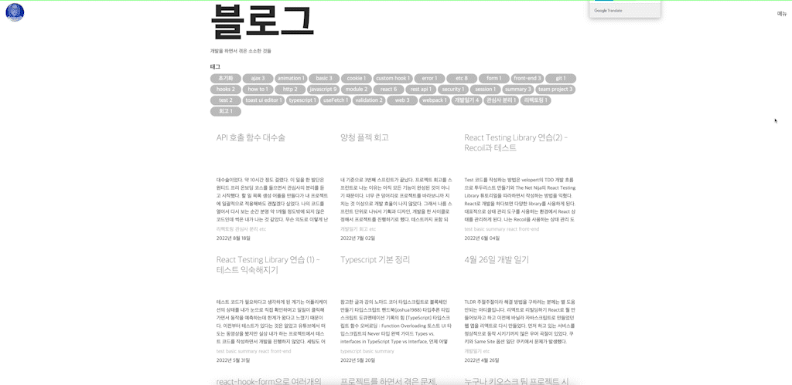
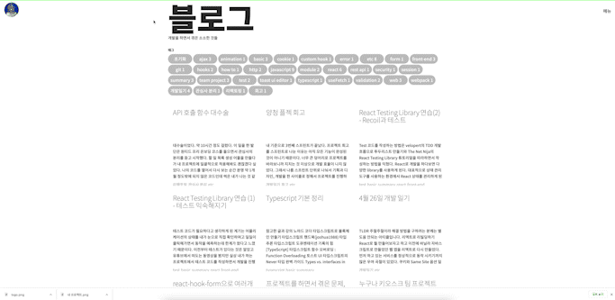

# 결론부터 말합니다.

TLDL;

- 아래 글은 저의 일기와 같은 형식으로 되어있습니다. 해결 과정이 궁금하면 읽으세요.
- 제가 찾은 해결 방법만 적용하고 싶다면 이 파트만 읽으세요.

> 참조  
> [Removing FOUC in a Gatsby Project](https://medium.com/@mikaelagurney/removing-fouc-in-a-gatsby-project-66034b8590b1)

**install package**

FOUC는 스타일 컴포넌트 문제일 수도 있고 @import를 사용하여 불러온 웹 폰트 때문일 수도 있습니다.

1. styled-components 때문이라면
   `gatsby-plugin-styled-components`, `styled-components`, `babel-plugin-styled-components`,
2. @import된 font 때문이라면
   `gatsby-plugin-typography`, `react-typography`, `typography`
3. 둘 다라면 둘 다 설치

```
$ npm install gatsby-plugin-styled-components styled-components babel-plugin-styled-components gatsby-plugin-typography react-typography typography
```

**setup gatsby-config.js**

```javascript
module.exports = {
  plugins: [
    {
      resolve: `gatsby-plugin-typography`,
      options: {
        pathToConfigModule: `src/utils/typography`,
      },
    },
    `gatsby-plugin-styled-components`,
  ],
};
```

**typography**

경로를 src/utils/typography로 설정했습니다.

```javascript
import Typography from "typography";

const typography = new Typography({
  baseFontSize: "10px",
  baseLineHeight: 1.666,
  googleFonts: [
    { name: "Noto Sans KR", styles: [100, 500, 900] },
    {
      name: "JetBrains Mono",
      styles: [200],
    },
  ],
  headerFontFamily: ["Noto Sans KR", "sans-serif"],
  bodyFontFamily: ["Noto Sans KR", "sans-serif"],
});

export default typography;
```

**setup layout with Globalstyle**

- Globalstyle  
  @import를 삭제하세요.

```javascript
- @import url('https://fonts.googleapis.com/css2?family=Noto+Sans+KR:wght@100;300;400;500;700;900&display=swap');
```

- layout  
  레이어 아웃에 적용 후 용도별로 서브 레이어아웃을 만들어서 반드시 각각 page 컴포넌트에 적용해주어야합니다.

> 참조  
> [jeonghwan-kim/jeonghwan-kim.github.com](https://github.com/jeonghwan-kim/jeonghwan-kim.github.com/tree/master/src/components/layout)

```javascript
import * as React from "react";
import Header from "../header";
import { ThemeProvider } from "styled-components";
import Globalstyle from "../GlobalStyle";
import { theme } from "../../theme/theme";

const Layout = ({ children }) => {
  return (
    <>
      <ThemeProvider theme={theme}>
        <Globalstyle />
        <Header />
        {children}
      </ThemeProvider>
    </>
  );
};

export default Layout;
```

이렇게 하여 FOUC를 없애고 성능을 개선할 수 있었습니다.

# FOUC 해결 과정



원티드 2주간 챌린지가 끝나면서 마지막 특강 시간에 나의 블로그의 FOUC에 대해 알게 되었다. 깜박임이 발생했던 것을 몰랐던 것은 아니지만 이 문제가 뭔지 정확하게 정의할 수 없었고 해결을 위해 시간을 쓰는게 아까웠다. 시간을 절약하기 위해 갯츠비로 블로그를 만들었기 때문에 뭔가 시간이 아까웠다. 하지만 멘토님이 문제를 정확하게 정의를 해주었기 때문에 해결을 안 할 수가 없었다. 문제가 정의 됐는데도 해결을 위해 노력하지 않으면 개발자로써 자존심이 좀 상한다고 해야할까? 그래서 이틀간 갯츠비에서 FOUC 문제를 해결하기 위해 공부했던 것과 과정 등을 적어보려고한다.

## FOUC(Flash Of Unstyled Content)

FOUC는 멘토님이 주신 [참고 링크](https://ko.wikipedia.org/wiki/FOUC)를 들어가 읽어보았다. 거기에 이렇게 나온다.

> 웹 브라우저가 웹 페이지에 스타일 정의를 부르고 적용할 때 보여지는 부분을 최대한 빨리 수정하지만, 이 변화는 짧지 않은 시간 동안 나타나므로 사용자는 페이지에 오류가 있다는 생각을 하게 된다.

즉, FOUC는 그냥 간과할 문제가 아니라 비즈니스의 수익과 직결되는 부분이 있는 것 같다. '오류 = 서비스 이탈'이라고 불러도 어색하지 않다. 위키에서는 브라우저의 문제로 보인다고 정의를 하고 있었다.

- 브라우저는 웹 페이지의 마크업에서 참조된 모든 부수적인 파일들을 모아 그 즉시 DOM을 빌드한다.
- 브라우저는 처음으로 표시할 가장 빠르게 분석할 수 있는, 즉 글의 내용을 골라 먼저 화면에 표시한다.
- 화면에 표시된 내용에 마크업의 순서에 따라 스타일을 적용하고 스크립트를 실행한다.

이건 브라우저 렌더링 과정이다. 조금 더 [자세하게 정리](https://d2.naver.com/helloworld/59361)해보면 아래와 같다.

1. 렌더링 엔진은 HTML 문서를 파싱한다.
2. 콘텐츠 트리 내부에서 태그를 DOM 노드로 변환한다.
3. **그 다음** 외부 CSS 파일과 함께 포함된 스타일 요소도 파싱한다.
4. 스타일 정보와 HTML 표시 규칙은 "렌더 트리"라고 부르는 또 다른 트리를 생성한다.
5. 렌더 트리는 색상 또는 면적과 같은 시각적 속성이 있는 사각형을 포함하고 있는데 정해진 순서대로 화면에 표시된다.
6. 렌더 트리 생성이 끝나면 배치가 시작된다. 각 노드가 화면의 정확한 위치에 표시되는 것을 의미한다. UI 백엔드에서 렌더 트리의 각 노드를 가로지르며 형상을 만들어 내는 그리기 과정이다.
7. **일련의 과정들이 점진적으로 진행된다는 것을 아는 것이 중요하다.**

[CSS는 렌더링 차단 리소스](https://web.dev/critical-rendering-path-render-blocking-css/)로 처리된다. [CRP(Critical Rendering Path)](https://web.dev/critical-rendering-path/)과정 중 렌더 트리를 그리려면 DOM과 CSSOM 둘다 필요하기 때문에 CSS가 불러와지지 않았거나 CSSOM이 그려지지 않으면 화면이 그려지지 않는다. 그렇다면 좀 이상하다. CSS가 렌더링 차단 리소스라면 FOUC가 발생하지 말아야한다. 그런데 발생을 하고 있다. 심지어 [나랑 똑같은 질문을 한 사람도 있다](https://stackoverflow.com/questions/53220261/if-css-is-render-blocking-why-do-we-see-fouc). 하지만 발생 원인에 대해서 몇몇 글을 읽었지만 딱히 속 시원하게 설명하는 글을 아직까지 찾을 수가 없었다.

> 참고  
> FOUC  
> [FOUC - 위키백과](https://ko.wikipedia.org/wiki/FOUC)  
> [FOUC(Flash of Unstyled Content)](https://github.com/im-d-team/Dev-Docs/blob/master/Browser/FOUC.md)  
> CRP  
> [CSS는 렌더링 차단 리소스](https://web.dev/critical-rendering-path-render-blocking-css/)  
> [CRP(Critical Rendering Path)](https://web.dev/critical-rendering-path/)  
> 브라우저 동작  
> [브라우저는 어떻게 동작할까 - Naver D2](https://d2.naver.com/helloworld/59361)  
> [프론트엔드 개발자라면 알고 있어야 할 브라우저의 동작 과정](https://yozm.wishket.com/magazine/detail/1338/)

## 해결책은 SSR?

구글에서 바로 [해결 책](https://medium.com/@mikaelagurney/removing-fouc-in-a-gatsby-project-66034b8590b1)을 얻어서 코드에 적용했다. 하지만 FOUC는 없어지지 않았다. 정확히 말하자면 50%만 해결되었다. GlobalStyle이 나중에 적용되었고 여전히 FOUC가 발생하고 있었다. 그러다 [유튜브에서 SSR](https://www.youtube.com/watch?v=G_dVwrhvkBI)에 Globalstyle을 적용하면 된다고 하길래 그렇게 했다. 그리고 대 참사가 발생했다. 페이지를 불러오는데 7초나 걸렸다. 말이 안된다. 겨우 텍스트를 불러오는데 7초를 쓰다니!!



처음에는 SSR이 원인일 것이라고 생각도 못한채 하루 종일 갯츠비 최적화를 뒤적거렸다. 당장 화면에서 이미지를 불러오는 것이 느리니까 이미지를 StaticImage로 불러왔다가 또 스타일이 적용이 안돼서 왔다 갔다....


성능 측정을 해보니 60점이 나왔다. 첫번째 컨텐츠를 불러오는 시간에서 가장 낮은 점수를 받았다. 그러다가 다른 사람이 만든 갯츠비 페이지를 가보았다. 대부분 개발자 페이지였는데 예전에 갯츠비를 처음 접할 때 김정환이라는 분의 유튭을 봤던 기억이 났다. 그래서 구글을 통해서 그분의 [블로그](https://jeonghwan-kim.github.io/)를 가보았다. 일단 컨텐츠를 불러오는 속도가 매우 빨랐다. FOUC도 없었다. 그래서 바로 깃헙으로 가서 코드를 살펴보았다.

일단 SSR을 전혀 사용하지 않았다. gatsby-browser.js에서 root 컴포넌트를 만들지도 않았다. Layout에서 Globalstyle을 해당하는 컴포넌트 들에게 내려주고 있었다.

당신이 오늘 접속한 나의 블로그에 FOUC가 없었다면 결론적으로 해결 됐다고 볼 수 있다. 성능 측정에 좋은 점수를 받은 것은 덤이다.


## 마무리

공부를 하면서 느낀 점은 뭔가 기술의 이름은 다르지만 내부적으로는 교집합이 있는 것 같다. 예를 들어 브라우저 동작 방법은 SSR, HTTP와 연관이 있다. 그러니까 묶어서 정리를 하고 면접 질문에서 나오면 잘 대답해볼 수 있도록 해야겠다. 그냥 개별적으로 놓고보면 조각인데 모으고 나면 하나의 그림이 되는 느낌이다. FOUC를 보다가 브라우저 렌더링 과정을 다시한번 복습해볼 수 있었다. 그리고 성능 최적화 문제도 FOUC와 연관성이 있었다.

블로그 FOUC까지 해결하고나니까 원티드 챌린지 과정을 끝난 것 같은 느낌이 든다. 하지만 느낌일 뿐 프리온보딩 챌린지는 아직 끝나지 않았다. 이제 이력서, 기업 지원, 기술 면접, 과제 등이 남아있다. '이걸 어떻게 넘나'라는 생각이 든다. 하지만 이번 기회를 통해 몰라서 안했던 부분을 알게 되었고 조금은 매꿀 수 있었다. 이렇게 누군가에게 배우는 과정은 매우 소중하다. 하지만 이제 떠먹여 주는 시간은 끝났다. 다시 내가 과제를 선정하고 해결하기 위해 메일도 보내보고 구글링을 하면서 시간을 보내야한다. 그러다 보면 언젠가는...
