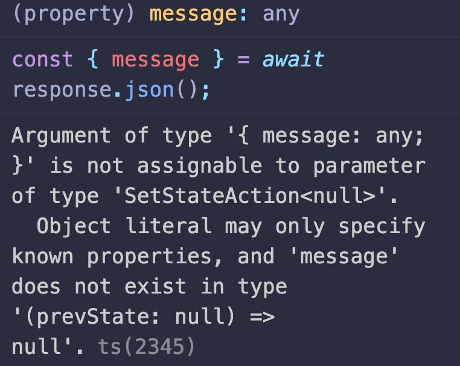

useFetch는 만들어 놓으면 사용할 때가 많아서 편리하다. React에서 서버와 비동기로 데이터를 주고 받는 경우가 많기 때문이다. useFetch가 없다면 비동기로 데이터를 주고 받을 때마다 복잡한 코드를 계속 작성해야한다. 불필요한 반복을 제거하기 위해서 useFetch를 만들었다. 처음에는 GET만 됐다. 하지만 POST, DELETE같은 다른 method에서도 사용이 가능해야했다. useFetch를 범용으로 만든 과정을 기록한다. 아울러 Typescript를 함께 사용하면서 오류를 해결한 과정도 함께 기록한다.

## GET부터 천천히

useFetch가 GET에서만 동작한다면 그다지 복잡하지 않다. 구글링만 잘 해도 수많은 예제가 나온다. 사실 useState, useEffect만 잘 활용해도 쉽게 만들 수 있다. 만들면서 Typescript에서 빨간색 밑줄이 쳐질때 interface로 type을 체크 했는데 왜 불만을 표시하는지 이해하지 못했던 경우가 가장 어려웠다.

```tsx
import { useState, useEffect } from "react";

interface IUseFetchProps {
  url: RequestInfo;
}

interface IReturnValue {
  data: any;
  isLoading: boolean;
  error: { message: string } | null;
}

const useFetchGET = ({ url }: IUseFetchProps): IReturnValue => {
  const [data, setData] = useState(null);
  const [isLoading, setIsLoading] = useState(true);
  const [error, setError] = useState<{ message: string } | null>(null);

  const fetchData = async () => {
    try {
      const response = await fetch(url);

      if (response.ok) {
        const { data } = await response.json();
        setData(data);
        setIsLoading(false);
      }

      if (!response.ok) {
        const { message } = await response.json();
        setError({ message });
        setIsLoading(false);
      }
    } catch (e) {
      console.log(e);
      setError({ message: "서버에서 요청을 거부했습니다." });
    }
  };

  useEffect(() => {
    fetchData();
  }, []);

  return { data, isLoading, error };
};

export default useFetchGET;
```



위와 같이 마우스를 올리면 어떤 점이 불만인지 알려준다. 위의 메시지는 message는 null이어야하는데 any가 되었기 때문에 그렇게 해서는 안된다고 이야기하는 것이다. 아마도 useState에서 null로 지정을 했기 때문에 error는 항상 null이어야한다고 추론하는 것 같다. 하지만 error가 발생했을 경우 객체 형태로 message를 저장하도록 코드를 만들었기 때문에 에러가 발생한 것이다. 그래서 형태를 정확하게 지정해줄 필요가 있는데 이럴때는 제네릭을 사용해서 데이터의 형태를 정확하게 알려주면 된다.

```tsx
const [error, setError] = useState<{ message: string } | null>(null);
```

## 다른 method로도 비동기를 하고 싶다.

불행하게도 어플리케이션은 GET만 하지 않는다. 사용자가 있다면 회원 가입, 로그인, 게시물 생성, 수정, 삭제 등의 요청을 서버로 보낸다. 위의 useFetchGET은 정말 서버로부터 GET요청만 보내기 때문에 범용으로 사용하기 어렵다. 나는 이것을 꽤 오랫동안 수정했다.(약 하루) Typescript를 함께 사용해서 그런것도 있다.

```tsx
import React, { useCallback, useEffect, useState } from "react";

interface IFetchProps {
  URL: RequestInfo;
  initState?: RequestInit;
}

export interface IUseFetchReturnValue {
  response: any;
  error: { message: string } | null;
  isLoading: boolean;
  csrfToken: string;
}

export const useFetch = ({
  URL,
}: IFetchProps): [IUseFetchReturnValue, Function] => {
  const [response, setResponse] = useState(null);
  const [isLoading, setIsLoading] = useState(false);
  const [error, setError] = useState<{ message: string } | null>(null);
  const [option, setOption] = useState({});
  const [csrfToken, setCsrfToken] = useState("");

  const handleOption = useCallback((options: RequestInit) => {
    setOption(options);
    setIsLoading(true);
  }, []);

  const setFetch = async ({ URL, initState }: IFetchProps) => {
    try {
      const response = await fetch(URL, initState);

      if (response.ok) {
        const { data } = await response.json();
        setResponse(data);
        setError(null);
        setIsLoading(false);
      }

      if (!response.ok) {
        const { message } = await response.json();
        setError({ message });
        setIsLoading(false);
      }
    } catch (error) {
      console.error(error);
      setError({ message: "서버에서 요청을 거부했습니다." });
      setIsLoading(false);
    }
  };

  const csrf = async () => {
    const response = await fetch("/getCSRFToken", {
      method: "GET",
      headers: {
        "Content-Type": "application/json",
      },
      credentials: "include",
      mode: "cors",
    });
    const result = await response.json();
    setCsrfToken(result.CSRFToken);
  };

  useEffect(() => {
    csrf();
    if (!isLoading) return;

    setFetch({ URL, initState: option });
  }, [isLoading, URL, option]);

  return [{ response, error, isLoading, csrfToken }, handleOption];
};
```

option을 useState처럼 지정하는 역할을 하는 함수가 필요했다. 처음에는 useState에서 setState를 밖으로 보내서 했지만 로직이 2% 부족했다. 왜냐하면 useEffet에 state의 변화를 감지하도록 설계하더라도 일단 한번은 실행하기 때문이다. 그래서 어떻게 수정할 수 있을까 찾다가 Youtube에서 useFetch를 만드는 튜토리얼을 찾았다.

> [Making a Custom Hook - usefetch Hook in React](https://www.youtube.com/watch?v=nJxpJ3wks90&t=205s)

Loading이 false일 때, useEffect에서 동작을 막아준다. 그럼 전체 로직을 최초에 실행하지 않는다. 대신 setOptions 함수를 외부에서 호출했을 때, isLoading이 true가 되면서 fetch를 진행한다. 나머지 로직은 처음과 거의 비슷하다.

하지만 튜플로 데이터를 리턴하는게 가장 어려웠다. typescript에서 계속 불만을 표시했기 때문이다. 처음에는 아래 코드처럼 interface를 만들고 return을 지정했다.

```tsx
interface IUseFetchReturnValue {
  data: any;
  error: { message: string } | null;
  isLoading: boolean;
  setOption: ({ URL, initState }: IFetchProps) => void;
}

interface IFetchProps {
  URL: RequestInfo;
  initState?: RequestInit;
}

export const useFetch = ({ URL }: IFetchProps): IUseFetchReturnValue[] => {
  //중략
  return [{ data, isLoading, error }, setOption];
};
```

Typescript는 튜플의 형태를 이해하지 못했다. 사실 내가 내보내려는 데이터의 형태가 튜플이라는 것도 몰랐다. 그냥 Array이고 저렇게 지정하면 알아서 추론할것이라고 생각했다. 결국 이것 저것 구글링을 하다가 저런 형태가 튜플이라는 것을 알게 되었다. 구글에서 구조 분해 할당을 타입스크립트에서 어떻게 하는지 검색('typescript with array destructuring')을 하고나서야 해결 방법을 알게 되었다.

[튜플의 형태를 정확하게 지정해주어야한다.](https://www.typescriptlang.org/docs/handbook/variable-declarations.html#array-destructuring)

> 튜플은 배열처럼 구조 분해됩니다; 구조 분해된 변수는 튜플 요소와 일치하는 타입을 얻게 됩니다:
> [튜플 구조 분해 (Tuple destructuring)](https://www.typescriptlang.org/docs/handbook/variable-declarations.html#array-destructuring)

```ts
let tuple: [string, number] = ["취준생", 35];
```

위의 예시를 보고 함수 반환 값을 다시 재지정해주었다. 그러자 문제가 해결되었다.

```tsx
export const useFetch = ({
  URL,
}: IFetchProps): [IUseFetchReturnValue, Function] => {};
```

## 마치며

Typescript는 사람이 할 수 있는 실수를 미리 막아주기 때문에 매우 편리하다. 처음 사용할 때, 빨간줄이 너무 많아서 좀 어려웠지만 다행히 vscode가 이유를 알려주기 때문에 그나마 빠르게 해결할 수 있었다. 그리고 구글에 자료가 너무 많아서 그 자료를 참고하면 생각보다 쓸만한 어플리케이션을 만들 수 있을 것 같다. Appendix에서 내가 생각했을 때, 좋다고 생각한 것을 공유했다.

## Appendix

1. [React & TypeScript - Course for Beginners](https://www.youtube.com/watch?v=FJDVKeh7RJI&t=2821s)

   - free code campe에서 제공하는 정말 좋은 자료다.

2. [Typescript로 블록체인 만들기](https://nomadcoders.co/typescript-for-beginners)

   - Nomad 코더에서 제공하는 무료 강의 Typescript를 한번 훝기 좋다.
   - [React 유료 강의](https://nomadcoders.co/react-masterclass)도 추천한다.

3. [Making a Custom Hook - usefetch Hook in React](https://www.youtube.com/watch?v=nJxpJ3wks90&t=205s)

   - 이 로직을 컨트롤 + c, v 했다.

4. [Typescript Generics Tutorial](https://www.youtube.com/watch?v=nViEqpgwxHE&t=947s)

   - 제네릭에 대해서 정말 깔끔하게 정리한 Awesome한 강의다.

5. [튜플 구조 분해 (Tuple destructuring)](https://www.typescriptlang.org/docs/handbook/variable-declarations.html#array-destructuring)

   - 이 문제를 해결한 가장 결정적인 역할을 했다.
   - Typescript를 React와 함께 사용해야겠다고 생각했을 때 가장 먼저 읽어본 문서다. 왜 사용해야하는지 명분을 얻고 싶다면 처음 Start부터 천천히 읽어보는 것을 추천한다.
   - 한국어 번역도 잘되어있다.
