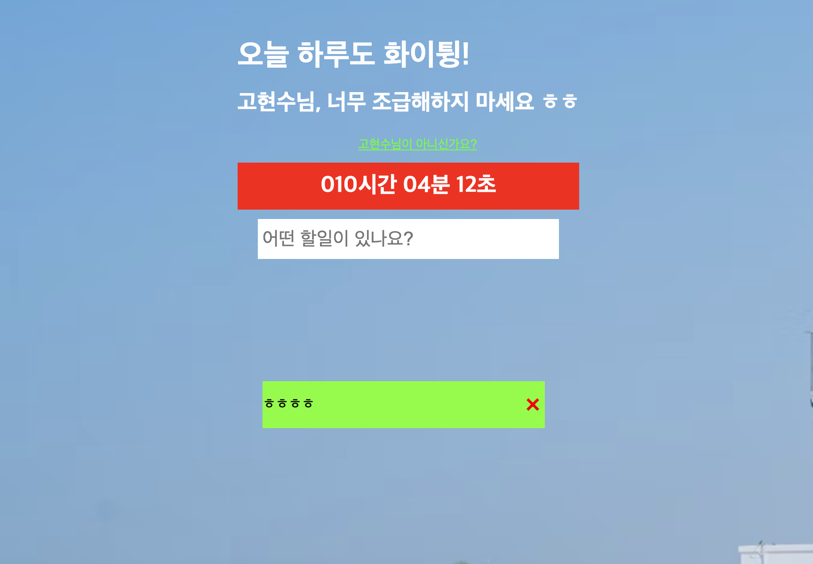

> 제목은 무라카미 하루키의 [달리기를 말할 때 내가 하고 싶은 이야기](http://www.yes24.com/Product/Goods/3239082)를 패러디 하였습니다.  
> 좋은 책입니다. 읽어볼 것을 권장합니다.

# Hello World

비어있는 스크립트 창에 console.log('hello world')를 입력하자 콘솔 창에서 "hello world"가 출력되는 것이 매우 신기했었다. 지금은 Hello World를 작성하지 않는다. 요즘은 console.log에서 벗어나려고 노력중이다. VSCode나 Chrome 개발 도구를 사용해서 디버깅을 하려고 노력 중이다. 새로운 도구에 대한 탐닉이라기 보다 에디터에 console.log를 치는 것이 귀찮아 졌기 때문이다. 처음엔 Hello World만 봐도 좋았는데 이제 console 디버깅이 귀찮아 새로운 도구를 찾고 있다. 자기에게 익숙해지는 것이 가장 당연한 사실이지만 때로는 익숙함이 권태를 가져오기도 한다.

몇 일 전 교육 기관에 선발 과제로 Todo App을 만들고 난 뒤에 조금 지쳤다. 나 스스로 Todo 앱을 만드는 일이 돈을 버는 행위와 그다지 상관 없는 것이 아닌가 하는 생각에 조금 우울해졌다. 좋게 말하자면 과정인데 노력의 수확을 걷어들이지 못하면 결국 과정이라고 어떻게 말할 수 있을까? 그럼에도 불구하고 Todo 앱은 만들 때마다 나의 현재를 반영하고 있다. 글을 쓰기 전에는 매번 만드는 Todo를 또 만드는 것이 지겨웠지만 쓰다보니 Todo 앱을 통해 배우는 것이 참 많았다. 생각해보면 처음 배포해본 프로그램도 Todo 앱이다.

# Todo는 만들기 쉽나요?

Todo는 노마드코더에서 자바스크립트 무료 강의를 들으면서 처음 만들어 보았다. form 태그에 input과 button을 넣고, querySelector로 선택자를 불러와서 화면에 내가 키보드로 쓴 글자를 보이도록 했다. 지금은 쉬워 보이지만 Todo App도 만드는게 쉽지 않아서 몇 번 챌린지에 실패하고 몇 번 따라 만들었다. 지금 와서 보면 생각대로 구현이 안되어있는 것이 눈에 보인다. Todo 앱은 쉬워 보이지만 원하는 것을 구현하기 위해서 생각보다 많은 것을 고려해야 한다. 그리고 내가 원하는 기능을 추가하기 위해서 알아야하는 것도 많다.

[](https://movie42.github.io/todolist/)
[처음 구현했던 Todo](https://movie42.github.io/todolist/)

자바스크립트 어플리케이션을 만들면서 함수를 이해하는데 애먹었었다. 어떤 매커니즘으로 함수가 동작하는지 잘 몰랐기 때문이다. 함수를 사용하기 위해서는 함수 선언문으로 선언하는 방법과 변수에 익명 함수를 할당해서 사용하는 방법이 있다. 또 화살표 함수를 사용할 수도 있다.

```js
function handleSubmit(text) {}

const handleSubmit = function (text) {};

const handleSubmit = text => {};
```

함수는 호출을 해야 동작한다.

```js
hadleSubmit("글 쓰기");
```

함수를 호출할 때 넘긴 값은 인자(argument)라고 한다. 함수를 선언할 때 ()안에 넣는 값은 매개변수(parameter)라고 한다. 인자는 외부 값을 함수에 넘길 때 사용한다. 그리고 매개변수는 함수 내부에서 인자로 넘어온 값을 처리할 때 사용한다.

```js
const handleSubmit = text => {
  return `${text}를 해야합니다.`;
};

handleSubmit("글 쓰기");
```

자바스크립트의 함수는 내부에서 일어나는 일에 최종 값을 return을 통해서 외부로 넘겨줄 수 있다. 물론 return을 하지 않을 수도 있다. 개발자가 함수에게 "너가 어떤 일을 해줬으면 좋겠어"라고 창조한다. 함수는 개발자의 말대로 움직인다. 함수가 어떤 값을 return하게 되면 자바스크립트에서는 return한 값을 변수에 할당하거나 다른 함수에 인자 값으로 넘겨줄 수 있다. 물론 다른 함수 내부에서 호출할 수 도 있다.

```js
const handleSubmit = text => {
  return `${text}를 해야합니다.`;
};

const paintTodo = text => {
  const text = handleSubmit("글 쓰기");
  const todoItem = document.createElement(todo);
  const todoContainer = document.querySelector(".todo-container");
  todoContainer.appendChild(todoItem);
};
```

함수를 만드는 것은 나의 어플리케이션에 생명을 불어 넣는 행동이다. 자바스크립트에서 함수는 정말 중요하다. 위에서 설명한 것 처럼 함수가 어떻게 선언되고 어떻게 호출될 수 있는지만 알아도 일단 Todo는 만들 수 있다. Todo를 만들면서 함수와 친해져볼 기회를 가질 수 있다.

하지만 함수형 프로그래밍이나 객체 지향 프로그래밍이라는 개념 안에 함수가 무엇인지 설명해야 한다면 함수 앞에 많은 수식어가 붙게 된다. 생성자, 고차, 클로저, 커링 함수 등이 있다. 생성자 함수는 보통 객체 지향에서 많이 쓰인다. 생성자 함수는 블루 프린트(설계도)와 같다. 그래서 생성자 함수는 인스턴스로 호출될 수 있다. 자바스크립트에서 함수는 일급 객체이기 때문에 함수를 값으로 사용할 수 있다. 그래서 고차 함수를 만들 수 있다. 고차 함수는 간단하게 말하자면 함수를 인자로 받거나 함수를 반환하는 함수다. 고차 함수는 함수형 프로그래밍을 가능하게 해준다. 클로저는 자신이 선언된 환경을 기억하고 있는 함수다. 실행 컨텍스트를 알게 되면 자연스럽게 클로저로 문맥이 이어지게 된다. 커링 함수는 여러 개의 인자를 인자를 하나씩 받아서 실행하는 함수로 바꿔주는 함수다.

이런 이론적인 문제는 사실 면접을 준비하거나 책을 읽다보면 알게 된다. Todo 앱을 만들면서 공부하게 되지는 않았다. 하지만 개념을 알게되면 Todo App에 적용은 해볼 수 있다. 어플리케이션의 규모가 작아 수정이 어렵지는 않기 때문에 이러한 개념을 위의 코드에 적용해서 개선해 볼 수 있다.

```js
// UserForm.js
function UserForm({ $target }) {
  const $userFormContainer = document.createElement("div");
  $userFormContainer.className = "user-form-container";
  $target.appendChild($userFormContainer);

  this.render = () => {
    $userFormContainer.innerHTML = `
        <form class="user-form">
            <input type="text" placeholder="누구신가요?"/>
        </form>
    `;
  };
  this.render();
}

// app.js
function App({ $target }) {
  new UserForm({ target });
}

// index.js
function Index({ $target }) {
  new App({ $target });
}

new Index({ $target: document.querySelector("#app") });
```

만약 Todo 앱을 페이지 단위로 나눈다고 하였을 때, 위처럼 생성자 함수를 사용해서 컴포넌트 단위로 나눈다면 재사용하기가 훨씬 쉬울 것이다. 명령형 프로그래밍과 선언형 프로그래밍이라는 개념도 공부할 수 있다. Todo 앱 하나를 이야기하는데 함수 하나만 이야기해도 많은 개념이 나온다. 여기에 원하는 기능을 붙이려고 한다면 배울 수 있는 것은 무궁 무진하다.

# 과거와 현재 나의 Todo

[현재 나의 Todo](https://mellow-fox-0d0e62.netlify.app/)는 배움에 대한 즐거움이라기 보다 생존의 문제에 더 가깝다. 절박해 보인다. 코드를 보면 스트레스가 느껴진다. '어떻게 하면 조금 더 좋은 코드로 비춰질 수 있을까?'라는 질문의 결과물이다. 만들면서 '무엇이 좋은 코드일까?'라는 고민보다 '어떻게 비춰질까?'라는 고민을 더 많이 했다. 물론 아이디어를 생각하고 해결해 나가는 과정은 여전히 즐거웠다. 하지만 결과가 '좋은 것인가'라는 대답에 '예'라고 자신있게 답할 수가 없다. 예전에 비해서 많이 아는 것은 사실이다. 더 빨리 만들 수 있는 것도 사실이다. 신경쓰고 고려한 것도 많다. 현재 나의 Todo는 내가 알고 있는 것을 최대한 활용해서 만들었다. 서식 검증 코드를 만들고 UX를 고려했다. 상태 관리 도구를 생각해보았다. 상태 관리를 어떻게 할지 생각해보았다. 컴포넌트를 어떻게 나눠야 할지 고민해보았다. 관심사 분리를 자연스럽게 생각해보았다. 비동기도 고려해 보았다. 타입스크립트를 사용하면서 타입을 어떻게 줄 수 있는지 고민을 했다. 폴더는 어떻게 나누는게 좋을지 고민해보았고 어떤 라이브러리를 사용하는 것이 좋을지 고민했다. 시작점과 현재를 이어보면 내가 어떻게 성장해왔는지 희미하게 보인다. 하지만 선명하지는 않다.

현재의 수준에서 Todo 앱은 여전히 만들기 어려운 어플리케이션이다. 아마 프로그래밍 경력이 쌓이더라도 Todo 앱은 그때의 수준에서 만들기 어려운 어플리케이션이 될 것 같다. 아마 그때마다 임계점을 넘어서는 고통을 겪어야 할 것이다. 그러나 그 이후에 물이 끓기 시작하면 맛있는 제육 볶음을 만들어 먹을 수 있다. 호기심은 식욕과도 같다. 항상 때가 되면 배가 고픈것 처럼 배울 수록 호기심은 더 늘어난다. 하지만 호기심을 채우기 위해서는 밥을 차려 먹어야한다. 처음엔 엄마가 차려준 밥을 먹는데 익숙하지만 나이가 들면 독립을 해서 밥상을 내가 차려야한다. Todo 앱은 나의 성장을 반영하고 있다. 지식을 습득하는 방향이 점점 떠먹여 주는 것에서 차려 먹는 쪽으로 바뀌어가고 있다. 앞으로 먼 미래의 이야기지만 나중에는 차려주는 사람이 될 수 도 있다. 내가 프론트앤드 개발자로써 현재에 대한 호기심을 지속적으로 가지고 있다면 Todo 앱은 호기심을 채우기에 평범한 한끼 식사가 될 수 있을 것 같다.
