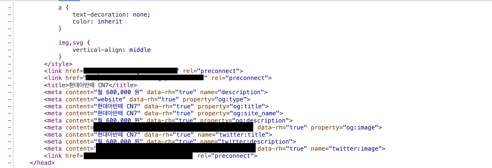

날씨가 많이 점점 추워지고 있다. 추위는 나의 몸을 매우 약하게 만들기 때문에 대비를 하기 위해서 여름 동안 달리기를 했다. 사실 무라카미 하루키의 책을 읽고 달려 보고싶다는 생각을 한지 1년이 넘었었다. 그러던 어느날 갑자기 더이상 걷기만으로 체력을 늘리는 것은 무리라고 생각했는지 '오늘부터 나는 달린다'하고 달렸다. 처음에 달릴 때는 1분도 못 뛰고 기침을 해댔다. 하지만 어느 동생의 권유로 런데이라는 서비스를 알게 되었고 지금은 30분을 힘겹게 겨우 뛴다. 아직 '너는 달리기를 잘하는 사람'이라고 몸이 기억 하고 있지는 않지만 계속 뛰다보면 1시간은 뛸 수 있는 날이 올 것만 같다.

# 나의 작은 세상에서 벗어나기

이번 한해동안 이력서를 많이 넣었다. 사실 조금만 더 준비된 뒤에 채용 시장에 뛰어들겠다고 생각만 하고 움직이진 않았다. 어느 날 이러다가는 10년이 지나도 백수로 살겠다는 두려움이 들었다. 그래서 적극적으로 이력서를 넣기 시작했다. 어느 곳에서도 최종 오퍼를 주지 않았지만 그래도 기술 면접을 진행하면서 채용을 경험할 수 있었다. 면접을 보면서 정말 얄미운 곳도 있었고 들어가고 싶은 회사도 있었다. 덕분에 들어가고 싶은 회사가 조금 명확해졌다. 사전 문답, 구현 면접을 보면서 회사에 대해서 많이 찾아보고 '여긴 정말 가고싶다.'는 생각을 하게 할 만큼 채용에 정성을 쏟는 곳도 있었다. 그곳은 과제에 대해서 피드백도 주었다. 떨어지긴 했지만 정말 멋있는 곳이라고 생각했다. 없는 시간을 쪼개서 나에게 정성을 들인 것이기 때문이다.

나의 작은 세상에서 벗어나기 위해서 외부 세계에 문을 계속 두드려야한다. 그건 공부, 채용, 서비스 운영 등 모든 부분에서 통용된다. 안주하면 부서진다. 내가 좋아하는 작가 C.S. 루이스는 '네 가지 사랑'에서 사랑을 한다는 것은 상처를 받을 수 있는 환경에 자신을 노출하는 행위라고 말한다. 그렇게 하고 싶지 않으면 아무와도 관계를 맺지 말고 상자 안에 자기 마음을 넣고 꽉 잠가 놓으라고 한다. 그럼 부서서지 않는다. 하지만 그렇게 하면 아무에게도 구원 받을 수 없다고 한다. 꽤 동의가 된다. 내가 어느 일을 좋아하면 그 일을 좋아 한다고 표현하는 과정이 채용 과정이다. 이력서를 넣고 떨리는 마음으로 답장을 기다리는 시간부터 면접을 보고 모니터를 닫는 모든 과정에서 나 스스로에게 실망하고 결과에 실망하는 그 과정은 아프다. 상처는 낫지 않고 깊게 패이고 흔적으로 남는다. 자랑스럽지 않고 자랑하고 싶지 않다. 하지만 그 과정이 없으면 좋아하는 것을 얻을 수가 없다.

그 이후에 나의 인생에 어떤 세상이 펼쳐질지는 아무도 모른다. 하지만 보다 더 객관적인 데이터, 나의 현재는 어디인가를 빠르게 알고 싶다면 다른 사람이 나를 봐주는 수 밖에 없다. 그것이 설령 설명이 부족하여 나에 대해서 오해를 했다고 할지라도 많은 데이터로 검증한다면 객관적으로 나를 보는 것이 가능하다. 채용시장에 뛰어 드는 것은 무모할지 모르지만 그런 장점이 있다.

# 팀 프로젝트, 배포 그리고 도커

## 팀 프로젝트

팀 프로젝트는 개인적으로 실패한 프로젝트다. 누군가 사용할 만큼 완성도가 높지 않았다. 이미지나 결재 모듈의 시크릿이 프론트앤드 빌드 단계에서 주입되어 웹에 노출될 수 있다는 것을 처음 알게 되었다. 최종 배포를 하고 나서 이 사실을 알게 되었다. 함께한 팀원들도 충분히 지쳐있었기 때문에 백앤드 개발에 더 매달릴 수 가 없었다. 하지만 실패가 꼭 완전한 실패라고 할 수는 없다. 덕분에 AWS 자동 배포를 경험할 수 있었고 서버를 바꾸는 과정에서 도커를 써보면서 편리함을 경험할 수 있었다.

팀 프로젝트의 가장 큰 장벽은 서로간의 소통이었다. 나의 문제를 말하면 가끔 동문서답이 올 경우가 많았다. 혹은 답변이 아얘 없다가 한참 뒤에 '할 수 없음'이라는 답변을 받기도 했다. 혼자 열의에 불타서 데모 화면을 만들고 피드백을 받으려하면 피드백이 느린 것도 문제였다. 그래서 팀 회의를 하면서 서로 이해를 했는지 묻고 답하는 과정에 시간 비용이 많이 들어갔다. 때로는 프론트앤드팀은 이렇게 생각하는데 백앤드팀은 이렇게 생각하는 경우도 있었다. 이런 저런 이유들을 조율하는 것이 만만치 않은 과정이었다. 슬랙, 노션 등 도구를 사용하긴 하지만 도구가 해결책이 되지 못했다. 결국 팀 회의 때 각자의 사정을 듣고 어느 정도 선에서 프로젝트를 마무리 할 지 결정 해야했다. 처음 기획과 확연하게 달라져버린 결과물을 보고 당황스러웠다. 회사라면 나는 PL로써 '무능력자'였다. 많은 시간 동안 그때의 실패를 돌아보면서 아직 신입이지만 PL이 된다면 프러덕트의 요구사항을 어떻게 충족 시킬 수 있을지 어떻게 소통을 해야 실패하지 않을지 나름 정리를 해보았다.

1. 질문은 상대방이 이해되도록 최대한 자세하게 올리기.

   - 내가 지금 요구 사항 안에서 무엇을 하고 있는지 알린다.
   - 왜 안되는지 상황을 적는다. 에러 상황이라면 에러 코드를 첨부한다. 스샷도 첨부한다.

2. 무조건 나는 된다는 식의 답변은 피하기.

   - '나는 되는데?'라고 하면 안되는 사람은 울고 싶어진다.
   - 상대방이 올린 질문과 내용을 잘 읽고 답변한다. 동문서답은 피하자. 질문 올린 사람 진짜 화난다.
   - 불필요한 질문은 없다. 단지 충분하지 않은 질문이 있을 뿐이다. 내가 이해가 안된다면 조금 더 자세한 상황을 설명해줄 것을 요청하자.

3. 피드백은 빨라야한다.

   - 팀원의 요청에 최대한 빨리 답장한다.
   - 내 범위에서 도움이 안될 것 같다면 다른 팀에 함께 도움을 요청한다.
   - 피드백을 안하다가 나중에서 안된다거나 고치라는 식의 답변은 피하자... 제발...

4. 리뷰 회고는 필요하다. 그러나...
   - 명령이 아닌 제안을 하자. 무조건 자신의 편의에 맞는 코드로 고치라는 식의 리뷰는 피하자.
   - 회고는 팀의 미래를 위해 필요하다. 효율적으로 회고를 할 수 있는 도구를 도입하자.

혼자 있을 때 기획 때 분명 '이렇게 하기로 합의를 봤는데! 왜 이제와서...' 샷건을 정말 많이 날렸다. 하지만 회사도 아니고 설령 모두가 있는 자리에서 화를 냈다고 해서 문제가 해결되지 않는다. 오히려 팀이 순시간에 깨져버릴 것이다. 규칙을 정하고 그 범위 안에서 소통하기 위해서 노력하는 것이 중요한 것 같다. 무엇보다 서로의 목표가 무엇인지 이해하는 것이 가장 중요한 것 같다.

## 배포

배포 과정은 순탄하지 않았다. 프론트앤드 개발자가 배포까지 해야하나하는 생각이 많이 들었었다. 하지만 개발자라면 어떤 환경에 놓여있을지 모르기 때문에 개발자가 아닌 사람을 설득하기 위해서 프로젝트 세팅부터 인프라 구성 지식을 알고 있어야 한다는 생각이 들었다. AWS 배포를 한번도 해본적이 없었다. 빌드를 한 리액트 프로젝트가 왜 단독으로 실행이 안되는지도 처음 알게 되었다. 하지만 당연한 것이었다. ExpressJS를 사용해봤다면 아래 코드에 익숙할 것이다.

- ExpressJS에서 '/' 요청에 대해 html을 보여주는 방법

```ts
import express from "express";

const app = express();

app.get("/", (req, res) => {
  return res.render("./src/index.html");
});

app.listen(PORT, () => console.log(`http://localhost:${PORT}`));
```

- Nginx에서 '/' 요청에 대해 html을 보여주는 방법

```conf
server {
    listen 80;
    server http://localhost:3000;
    root /usr/share/nginx/html;

    location / {
        index  index.html index.htm;
        try_files $uri $uri/ /index.html;
    }
}

```

어떤 URL에 요청을 보내면 서버는 기본적으로 HTML 파일을 브라우저에 보내준다. 브라우저는 HTML을 받아 읽는다. HTML에는 어떤 CSS와 Javascript 파일을 사용하여 스타일링을 하고 사용자와 인터렉션을 할 것인지 표현되어있다. 그러니까 클아이언트는 서버가 있어야 동작이 된다. SSR이든 CSR이든 사용자가 요청한 URL에 어떤 것을 보여줄 것인지에 대한 이야기다. 리액트는 클라이언트의 UI를 효율적으로 빠르게 설계할 수 있도록 도와주는 라이브러리다. 기본 동작 원리는 결국 근본을 벗어나지 않는다.

나는 nginx라는 서버를 사용했다. node를 사용해서 보여주는 것도 가능하다. 그 밖에 여러가지 선택지가 있다. nginx는 생소하긴 했지만 내가 지정한 URL에 사용자가 접근하고자 했을 때, 어떤 파일을 보여줄 것인지 결정하는 원리는 express와 비슷했다. heroku에 배포 할 때, npm 패키지를 통해서 프록시 서버를 입력하고 api 서버 위에 빌드된 파일을 올려 놓았기 때문에 이것을 이해하는 과정이 생략되어 있었다. 하지만 지금은 저 원리를 기억하면 서버가 어떤 식으로 사용자의 요청에 반응하는지를 알면 가벼운 수준 안에서는 써먹어볼 수 있을 것 같다.

하지만 분명 클라이언트는 "/"만 요청하지 않는다. 콘텐츠를 요청했을 경우 적절한 응답값을 보여주어야 한다. 공개된 오픈 소스 API는 'https://api.xxx.com/xxxx'와 같은 형식의 주소를 fetch 함수로 가져올 수 있다. 그러나 어플리케이션의 리소스가 외부에 공개되는 것을 원하지 않는다. 그럴 때 프록시를 사용해서 요청을 우회하여 데이터를 받아올 수 있는데 nginx가 이런 부분에서 유용했던 것 같다.

## 도커

도커는 정말 엄청난 도구다. 모든 이에게 꼭 사용하라고 추천을 해주고 싶다. 토커는 컨테이너 단위로 동작하면서 컴퓨팅 리소스를 공유해서 사용하기 때문에 컨테이너 개수당 컴퓨터 리소스가 제약되지는 않는다. 도커의 가장 편리한 점은 배포 환경이 컨테이너 단위로 독립 되어있기 때문에 컨테이너에서 문제가 생긴다면 그냥 통채로 변경하면 된다. 처음 AWS 배포는 정말 지옥이었다. 하나의 인스턴스 안에 프론트앤드, 백앤드, 데이터베이스 그리고 dev 환경도 띄어야하기 때문이었다. 서로 엮여 있는 경우가 있어서 하나가 잘못되면 다 갈아 치워야하는 경우가 생겼다. 하지만 도커는 뭐가 문제가 생기던간데 그냥 그걸 새로 통채로 다시 만들어서 교환하면 되었다. 배포가 필요하다면 반드시 꼭 도커를 사용해서 배포하기를 권장한다.

> [도커로 배포한 썰](https://movie42.github.io/deploy/docker-first-time)

# 구조와 설계

8월부터 원티드에서 진행하는 프리온보딩 챌린지와 코스를 들었다. 취업이 되면 좋겠다는 막연한 생각과 무료이기 때문에 부담없이 신청했다. 그런데 의외의 수확이 있었다. 배운 것이 너무 많다. 만약 누군가가 이 글을 읽고 있다면 원티드에서 진행하는 프리온보딩 코스나 챌린지를 꼭 들어보라고 권유하고 싶다. 해당 주제는 포스팅을 따로 하려고 했지만 아직 찍먹 수준이다. 프로젝트 전반에 걸쳐서 적용과 피드백을 받고 있지 않기 때문에 일단은 간략한 내용들을 회고 수준에서 정리하려고 한다.

## 폴더 구조

[폴더 구조는 왕도가 없는 것 같다.](https://www.robinwieruch.de/react-folder-structure/) 나름대로 논리를 가지고 형태를 잡은 다음에 필요에 따라 변경하도록 제안한다. 조금 규모가 있는 프젝트에서 나름 이렇게 구조를 가지고 가면 만든 파일을 또 만드는 중복을 피할 것 같다는 생각을 했다.

```
├── src
│   ├── components
│   ├── lib
│   │   ├── api
│   │   ├── assets
│   │   ├── constants
│   │   ├── types
│   │   └── utils
│   ├── model
│   ├── pages
│   ├── service
|   ├── routes
```

- Components 폴더는 전역에서 재사용되는 컴포넌트를 보관하면 효율적이라고 생각했다. 이 안에는 Layout, Button, Form, Input, ListItem, ListContainer와 같이 같은 스타일, 기능 등 여러곳에서 반복되는 것들이 들어가면 여러 곳에서 중복 없이 컴포넌트를 생성하고 재사용 가능할 것 같다.
- Model 폴더는 HTTP 통신을 할때 주고 받는 데이터의 형태를 저장하는 곳이라고 정의해봤다. 예를 들어 로그인을 할 때, 주고 받는 것의 형태가 다른데 이곳에 정의를 하면 전역으로 타입을 재사용할 수 있을 것이라고 생각한다.

```ts
export interface LoginVariable {
  email: string;
  password: string;
}

export interface LoginData {
  accessToken: string;
  users: {
    id: number;
    email: string;
  };
}
```

- Pages 폴더는 유저에게 보여줄 페이지 컴포넌트가 모여있는 곳이다. Notice, Notice Detail, Notice Create, Notice Update 등과 같이 세분화하여 저장할 수 있다. 아직 고민이 되는 부분은 Notice Detail안에 들어갈 Notice List라던가 Notice Modal과 같은 것은 컴포넌트에 저장해야하는지 아니면 상위 폴더인 Notice에 저장해야하는지 잘 모르겠다. 응집도 측면에서 보면 Components는 정말 재사용되는 것만 저장하고 페이지 폴더에는 Components를 통해 스타일이나 기능이 재지정된 컴포넌트들이 모이면 더 효율적이지 않을까? 그러나 이렇게 지정하는 것이 규모가 커질 수록 좀 복잡해지는 경향이 있다. 가끔 응집도를 모은다고 컴포넌트 안에 hooks까지 함께 저장하다보면 햇갈린다. 그렇다고 분리하면 오히려 분리한대로 햇갈린다. 결국 규칙을 항상 인식하고 찾아서 사용하는 것이 중요해보인다.
- Service는 사실 최근에 지정하게 된 폴더이다. Service 개념은 아직 잘은 모르지만 나는 잡일하는 컴포넌트라고 생각했다. 이건 클린아키텍쳐 관점에서 봤을 때, 특정 라이브러리나 함수에 종속되는 것을 막기 위해서 repository, service, instance, model 등을 나누어 지정하면 하나의 함수가 변경 되었을 때 수정을 최소화 할 수 있는 이점이 있는 것 같다. 이제 막 사용해보고 어떻게 설계할지 공부하고 있다. 나중에 기회가 되면 포스팅으로 나누면 좋겠다.
- Routes는 라우팅을 모아놓은 곳이다. 리액트 프로젝트를 react-router-dom으로 라우팅을 하였는데 서비스 도메인이 여러개가 되면 Router를 한곳에 몰아넣기 난감한 상황이 오게 된다. 그러다보면 도메인 중심으로 router를 분리하게 되는데 여기에는 횡단 관심사가 적용되기 때문에 PrivateRouter라는 컴포넌트를 설계에 적용하게 된다. 그러면 충분히 복잡도가 올라가기 때문에 폴더별로 나누는 것이 중요해보인다.
- lib 폴더는 전역에서 사용되는 유틸함수, 타입, 상수, 커스텀 훅 등이 모여진다.

폴더 구조는 고민이 많아지는 부분이다. 하지만 그때 그때 어플리케이션이 커지면서 구성을 재조정 하는 과정을 거쳐가면 프로젝트에 맞게 폴더를 구성할 수 있지 않을까?

## 재사용하는 컴포넌트를 어떻게 설계할까?

컴포넌트 폴더는 재사용되는 컴포넌트를 모아 놓는 곳이라고 생각한다. 예를 들어 버튼에 한정해 설명을 해보고 싶다. 보통 버튼 컴포넌트는 여러곳에 걸쳐서 재사용된다. 재사용은 커스터마이징이 중요해진다. 각 니즈에 따라서 스타일과 기능이 변경될 수 있어야한다. 여러곳에서 커스터마이징이 되기 위해서 스타일이나 기능이 컴포넌트에 종속되지 않는 것이 중요하다.

<div class="embeded-video">
<iframe src="https://stackblitz.com/edit/react-ts-xwrtlb?file=Components/Button.tsx"></iframe>
</div>

나는 나름대로 스타일을 지정하는 역할은 스타일 컴포넌트에 위임했다. 그냥 일반적으로 적용되는 스타일만 지정했다. 기능은 React.ButtonHTMLAttributes<HTMLButtonElement>를 확장해서 Button 컴포넌트가 기본적으로 가지고 있는 속성을 사용하도록 지정했다. 이렇게 설계를 했을 때 스타일의 변경을 위해서 따로 size, padding, color와 같은 Props를 지정할 필요가 없다. 그냥 디자인 혹은 기획 단계에서 컬러, 에러, 취소, 확인 등과 같은 역할을 미리 정해놓고 theme을 지정한 뒤에 그것을 가져다 쓰면 될 것이다. 이건 button을 가지고 생각한 단순한 회고에 불과하다. 조금 더 유연한 컴포넌트의 설계를 위해서 설계에 대해서 진지해질 필요가 있다고 생각하게 되었다.

> 더 알아보기
> [FECONF 2022 [B1] 디자인 시스템, 형태를 넘어서](https://youtu.be/21eiJc90ggo)  
> [[A3] 컴포넌트, 다시 생각하기](https://youtu.be/HYgKBvLr49c)

## 컴포넌트의 느슨한 의존 관계를 위해서

위의 주제와 같은 맥락을 가진다. Headless 컴포넌트, 선언적 프로그래밍, 제어 역전, 관심사 분리 등 여러 개념을 익히고 설계에 적용해보려고 노력했다. 하지만 완전하진 않다. 그래서 일부분 추상에서부터 구체적인 단계까지 함수를 구현했던 과정을 정리하려고 한다.

### 추상화

아직 추상화를 먼저 하고 구현으로 들어가지는 않는다. 그냥 추상화와 구현을 동시에 하면서 interface를 만들고 함수를 구현한다. 꼭 class로 구현할 필요도 없다. 그냥 단계 별로 생각을 해보았다. 예를 들어 Cookie를 가져오고 저장하고 제거하는 기능이 필요해졌다. 그럼 typescript를 사용한다면 interface로 get, set, remove를 추상화해볼 수 있다.

```ts
interface ICookiesService {
  getCookie: () => void;
  setCookie: () => void;
  removeCookie: () => void;
}
```

아직은 충분하지 않다. 고민을 해보면 getCookie는 cookie의 key값을 받아서 key에 해당하는 value를 반환해준다. setCookie는 key와 value를 받아서 cookie에 저장하는 역할을 한다. 값을 반환할지 말지는 선택 사항으로 보인다. removeCookie는 key값에 해당하는 쿠키를 제거한다. 다시 설계를 해보면 이렇다.

```ts
interface ICookieService {
  getCookie: <TValue>(key: string) => TValue;
  setCookie: <TValue>(key: string, value: TValue) => void;
  removeCookie: (key: string) => void;
}
```

### 구현해보기

구체적으로 이렇게 구현을 할 수 있다.

```ts
class CookieService implements ICookieService {
  getCookie = <TValue>(key: string) => {
    const cookies: TValue = JSON.parse(cookiePackage.getCookie(key));
    return cookies;
  };

  setCookie = <TValue>(key: string, value: TValue) => {
    const cookieStringValue = JSON.stringify(value);
    cookiePackage.setCookie(key, cookieStringValue);
  };
  removeCookie = (key: string) => {
    cookiePackage.removeCookie(key);
  };
}
```

만약 생성자 함수를 인스턴스화 하는 과정에서 key 값을 고정해서 사용하고 싶다면 constructor에서 key를 받아서 인스턴스화를 할 수 있고 그게 아니라 나는 그냥 static으로 사용하고 싶다면 static으로 함수를 선언할 수 있다. 아직 뭐가 좋은지는 모르겠지만 나는 그냥 key를 인스턴스 과정에서 받아서 선언하고 다른 곳에서는 걱정 없이 그냥 사용만 하고 싶어 졌다.

```ts
import cookiePackage from "cookiePackage";

interface ICookieService {
  getCookie: <TValue>() => TValue;
  setCookie: <TValue>(value: TValue) => void;
  removeCookie: () => void;
}

class CookieService implements ICookieService {
  private key;
  constructor(key: string) {
    this.key = key;
  }
  getCookie = <TValue>() => {
    const cookies: TValue = JSON.parse(cookiePackage.getCookie(this.key));
    return cookies;
  };

  setCookie = <TValue>(value: TValue) => {
    const cookieStringValue = JSON.stringify(value);
    cookiePackage.setCookie(this.key, cookieStringValue);
  };
  removeCookie = () => {
    cookiePackage.removeCookie(this.key);
  };
}

export default CookieService;
```

쿠키 관련 라이브러리를 사용한다는 가정하에 설계를 했다. 조금 아쉬운 부분이 남지만 이렇게 쿠키를 가져오고 세팅하고 제거하는 라이브러리의 반복처럼 느껴지지만 이렇게 Service로 나누어 처리를 하게 되면 저장하는 곳이 쿠키가 아니라 로컬 스토리지로 변경되었을 때나 혹은 라이브러리가 변경되었을 때, 교체하기 쉽다는 이점이 있다. 다른 이점으로 팀 프로젝트를 진행할 때, 프로젝트가 병렬로 진행될 수 있다. 해당 서비스가 필요한 개발자가 여러명일 경우 구체적인 구현을 기다릴 필요 없이 interface를 가져와 구현을 하면된다. 나중에 설계가 변경되었다고 하더라도 핵심 구현을 전부 갈아 엎을 필요가 없다. 왜냐하면 서로 느슨하게 연결되어있기 때문이다. A 기능이 B에 종속적이라면 A가 수정되면 B가 전부 변경될 가능성이 높다. 그러나 의존 관계가 느슨하다면 A가 변경되어도 B는 일부분(이름과 같은)만 변경해도 될 것이다. 그럼 프로젝트에서 사용되는 라이브러리나 DB와 같은 것이 변경되더라도 모든 코드를 다 열어서 수정할 필요가 없어진다.

```ts
export const getNotices = async (req: Request, res: Response) => {
  try {
    const secret = req.app.get("JWT_SECRET");
    const checkUser = jwt.verify(accessToken, secret);

    if (!checkUser) {
      return res.status(403).json({ message: "권한이 없습니다." });
    }
    //생략
  } catch (error) {
    return error;
  }
};
```

위의 함수는 express에서 클라이언트의 요청에 따라 notice 목록을 보내주는 controller 함수다. 내가 생각한 문제점은 다음과 같다.

1. try/catch로 error처리가 반복된다.
2. 사용자 검증 방법이 다른 방법으로 변경되면 저 부분을 변경해야한다.

이런 형태의 함수가 16개 이상의 함수에서 반복된다. 에러를 핸들링 해야하는 이유도 전부 다르다. 어떨때는 DB에서, 어떨때는 JWT에서 어떨때는 서버에서 에러가 발생한다. 위 형태의 함수는 각 에러를 if로 다 처리해주어야한다. 물론 이 함수 하나라면 그다지 문제가 되지 않을 수 있지만 형태가 반복되고 수정을 해야한다면 함수 개수만큼 유지보수를 해주어야한다.

어플리케이션 개발 속도가 느린 이유를 잘 몰랐다. 하나가 고장나면 프론트와 백앤드 모두 만들어야해서 그렇다고 생각했다. 그런데 지금와서 생각해보면 그게 문제라기보다 기능과 기능의 결합이 너무 강하다. 백앤드뿐만 아니라 프론트앤드 컴포넌트도 이런 비슷한 형태가 자주 보였다. 프론트앤드 컴포넌트도 기능을 하나 바꾸면 다른 곳에서 영향을 받게 되어 버그를 찾아 헤매느라 기능 추가가 두려워졌다. 그러다보니 애초에 계획했던 서비스를 다 만드는게 어려워졌다. 지금은 더이상 손을 쓰기 어려워서 새로운 기능을 만들기 전에 재설계가 필요해졌다. 채용 과정에서 컴포넌트에 대해서 묻고 컴포넌트 설계에 대한 나의 관점을 반복해서 물었던 이유는 이 경험으로 충분히 대답이 될 수 있을 것 같다. 아직 규모가 엄청나게 크진 않고 고칠만 하다. 하지만 상용화된 서비스에서 제공하는 기능의 가지수만 놓고 봤을 때 설계가 이런식으로 되어있다면 서비스의 미래는 답이 없을 수도 있다.

# CSR, SSR

브라우저 랜더링은 HTML을 파싱하는 것에서 시작된다. HTML을 브라우저가 읽을수 있게 파싱을 하고 DOM 트리를 만든다. CSS가 있다면 읽어서 CSSOM 트리를 만든다. 그 후에 두 트리를 랜더 트리로 합성한다. 랜더 트리에는 HTML 요소의 색, 크기, 위치 정보가 들어있다. 랜더 트리를 그리고나면 사용자는 화면을 보게 된다. CSR은 비어있는 HTML을 받아서 이 과정을 브라우저가 수행하게 된다. 그렇기 때문에 초반에 TTV 느리다는 단점이 있지만 그 이후에는 TTV, TTI가 빠르다. SSR은 서버에서 그려진 HTML을 받아서 브라우저가 이 과정을 수행한다. 그렇기 때문에 SSR은 초반에 TTV가 빠르다. 하지만 TTV와 TTI간 시간차가 존재한다.

SEO를 해야한다면 CSR만으로 충분하지 않을 가능성이 높다. 예전에 프로젝트를 만들면서 스스로 SEO [이슈](https://github.com/movie42/ychung-frontend/issues/25)를 등록했던 적이 있다. React-helmet이 원하는 대로 동작하지 않았다. 주소창에 어떤 URL을 넣으면 meta에 입력한 정보가 들어있지 않았다. 분명 개발자 도구에는 들어있는데 왜그럴까? 네트워크 창에 들어가서 응답받은 index.html을 보면 아무것도 없다. 그냥 비어있다. CSR에서 비어있는 html을 가져온다는 것을 직접 눈으로 확인할 수 있었다. 당연하다. public 폴더에 있는 index.html에 아무것도 없으니까. 이 문제를 해결할 수 있는 방법은 React에서 제공하는 [hydrateRoot()](https://ko.reactjs.org/docs/react-dom-client.html#hydrateroot)(React18)를 사용해서 서버에서 SSR을 해주면 된다고 한다. 지금까지는 그냥 외우기만 했는데 직접 경험해볼 수 있는 좋은 기회였다. 원티드 팀 과제를 하면서 SEO가 요구조건에 있었는데 CRA에서 express로 서버를 띄워서 hydrate를 시도했지만 실패했다. 그래서 팀원분이 NextJS를 사용했는데 NextJS에서 제공하는 getServerSideProps 함수를 사용해서 SSR을 하였다.

```ts
export const getServerSideProps: GetServerSideProps = async () => {
  const queryClient = new QueryClient();
  await queryClient.prefetchQuery(["cars", "ALL"], getCars);
  return {
    props: {
      dehydratedState: dehydrate(queryClient),
    },
  };
};
```



결과적으로 html은 미리 채워져있었다. NextJS를 사용하면 SSR을 할 수 있다는 그냥 그저 그런 문자적인 말에 불과했는데 직접적으로 체험을 해볼 수 있는 소중한 기회였다.

> 참고  
> [CSR 앱에서 SSR + CSR 환경으로 이주하기](https://tecoble.techcourse.co.kr/post/2021-09-10-ssr/)

# 우물을 팠지만 충분히 물이 나올만큼 깊게 팠나요?

이번 한 해는 목마른 사람이 우물을 파야한다는 속담을 몸소 체험해 보았다. 하지만 우물을 파는 시도만 하면 목 마름은 채울 수 없다. 팠을때, 물이 나와야하고 그 물을 먹어야 목마름이 채워진다. 우물을 파기 전에 물이 나온다는 정보, 나올 것이라는 믿음 그리고 실행력이 있어야 한다. 물이 오염된 물인지 깨끗한 물인지도 중요하지만 어쨌든 우물을 판다는 입장에서 가장 중요한건 물이 나와야한다. 프로그래머가 되기 위해서 취업이라는 관문을 넘고 싶었다. 그래서 이곳 저곳 정보 모아 그 정보를 믿고 여러가지 실행을 해보았다. 생각보다 결과가 공허하지는 않다. 흙 위에 물이 조금씩 젖어드는 것을 목격한 기분이다. 하지만 아직 목표에 완전히 도달하지 못했다. 조금 더 깊게 파야한다. 앞으로 이력서를 쓰고 진행했던 프로젝트를 한번 돌아보고 수정하고 배운것을 체득하기 위해서 반복적으로 트레이닝을 해야한다. 그 과정이 조금 더 깊게 우물을 파내려가는 과정이라고 생각한다. 시간이 얼마나 걸리던지간에 나는 무릎까지 물이 차 오를 때까지 더 깊게 파볼 생각이다. 그 우물만 파다가 좌정관천이 될까 하는 걱정 따위는 일단 거기까지 간 뒤에 해 볼 수 있을 것 같다. 물이 나와야 이 물을 마실지 농업 용수로 쓸지 다른 사람에게 나누어 줄지 우물 대신 호수를 파는 것으로 전환할지 생각해 볼 수 있을 테니까.
