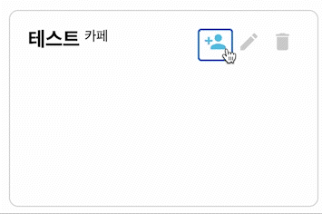

내 기준으로 3번째 스프린트가 끝났다. 프로젝트 회고를 스프린트로 나눈 이유는 아직 모든 기능이 완성된 것이 아니기 때문이다. 너무 큰 덩어리로 프로젝트를 바라보니까 지치는 것 이상으로 개발 효율이 나지 않았다. 그래서 나름 스프린트 단위로 나눠서 기획과 디자인, 개발을 한 사이클로 정해서 프로젝트를 진행하기로 했다. 테스트까지 포함 되어야하는데 테스트가 계속 생략되고 있다. 어쨌든… 각설하고 프로젝트를 스프린트 단위로 3번까지 진행을 하면서 어떤 것을 배웠었는지 다시 한번 상기하기 위해 회고록을 작성한다.

# 스프린트 1

## 프로젝트의 이유는 코로나

나는 교회를 다닌다. 그래서 오프라인에서 매주 일요일에 사람들과 만나서 이야기를 대화하는 것을 즐거워한다. 좋아서 시작한 주보 만들기, 간행물 발행, 타의에 의해서 시작한 기록물 관리는 매주 사람들과 만남의 연속이었다. 그런데 어느 순간 직장을 다니게 되고 정신 없는 하루가 흘러가는 동안 코로나가 일상이 되었고 대면으로 했던 모든 것은 중단되다시피 했다. 처음에 프로젝트는 별 생각 없이 그동안 종이로 발행했던 주보를 온라인으로 공유해서 예배를 운영하기 위해 교회에 나오는 사람들 그리고 유튜브로 예배를 드리는 사람들을 위해서 정보를 제공하기 위해서 시작하게 되었다.

그리고 정말 볼품 없는 홈 페이지를 하나 대강 만들어 놓았다. 텍스트만 하얀 화면에 떠다니던 첫 프로젝트는 나의 기억속에서 잊어졌다.

## 겨우 클론 코딩을 끝냈더니

클론 코딩을 반복해서 한 다섯번정도 들었던 것 같다. 그때는 지금과 비교해서 개발 공부를 어떻게 해야하는지도 잘 몰랐기 때문에 그냥 주먹 구구식으로 했던 것 같다. 뭐가 있다고 하면 그걸 하고 뭐가 있다고 하면 그걸 하고 이런 식으로 공부를 하다가 그냥 뭐도 이도 저도 아니게 되어버렸다. 처음에 클론 코딩이 딱 끝나고나서 취업을 할 수 있지 않을까?라고 생각을 했었다.

그런데 내가 시작할 때, 별 생각없이 시작했는데 시장의 사정은 훨씬 험난했다. 취업 시장에서 계속 ‘좋은 개발자'를 모집한다고 그랬을 때, ‘아니 그러니까 좋은 개발자가 뭔데요?’라고 되물으면서 훌쩍거리던 시기가 있었다. 클론 코딩으로는 취업을 할수가 없다고 그러더라. 누군가 ‘뭘 만들어 보세요'라고 말했던 것이 생각났다. 그래서 몇번이고 따라 만들어봤고 HTML, CSS는 기본은 안다고 생각하니까 나의 프로젝트를 하면 되겠다 싶어서 그냥 겨우 숨만 쉬고 있는 양청 프로젝트를 서랍장에서 꺼냈다.

아니 그런데 왠걸? 다시 공부하면서 모르는 개념이 마구 마구 튀어나왔다. 안다고 생각했던건데 정리해보려고 하니까 설명을 할 수가 없었다. 로그인 하나 만드는데 뭐가 이렇게 모르는게 많을까…

- 자바스크립트
  - 실행 컨텍스트와 가비지 콜렉션
  - 클로저
  - 1급 객체는 함수
  - 사실 모든게 다 객체다.
  - 배열 다루기
  - 객체 다루기
  - 이벤트, 이벤트 관리, 이벤트 위임
  - 고차 함수, 함수형
  - 애니메이션
- XSS, CSRF
- CSP, SOP
- 쿠키, 세션
- HTTP
- REST API
- 브라우저
- 인터넷
- 깃헙
- 웹펙
- 모듈, 모듈 번들러
- MVC
- 디자인 패턴
- 객체지향, 함수형
- 컴포넌트와 Class
- 클린 코드
- 테스트
- 비동기
- Git
- 그밖에 에러들…

‘자바스크립트 그냥 함수 쓰고 동작시키면 되는거 아니야?’라고 생각했었는데 아니었다. 그래서 일단 그냥 책을 한번 쭉 읽어보기로 했다. 회사에 다니면서 퍼블리싱에 도움이 될까 해서 아주 오래전에 사놨던 책이었다. 생각보다 모르는게 너무 많았다. ‘어쩌지 취업해야하는데.’라고 생각하면서 그렇게 일년이 훅 지나가버렸다. 나름 열심히 깃 저장소도 만들고 배운것도 정리했지만 왜 손에 잡히는게 없을까.

# 스프린트 2 : 마이그레이션

- 타입스크립트와 리액트
- Reset API와 오버패칭
- 애니메이션과 Framer motion

바닐라 자바스크립트는 난이도가 높은 장난감이었지만 자유도가 매우 높았고 내 마음대로 이것 저것 시도해 볼 수 있었다. 하지만 시도한 만큼 실패도 늘어갔다. 그리고 기능 하나를 만드는데도 이상하리만치 시간이 많이 지났다. 어플리케이션 전체는 MVC 패턴으로 개발을 했는데 시간이 지날수록 그 규칙을 따를 수가 없었다. 뭐가 모델이고 뷰이고 컨트롤러인지 뒤죽박죽 섞여서 형태를 알수없는 무언가가 되어가고 있었다. 코드도 어플리케이션도 점점 이상해지기 시작했다.

리펙토링을 총 2번 했다. 첫번째 리펙토링은 이벤트 중심으로 모듈화를 해서 나눴다. 처음엔 매우 만족스러웠다. 하지만 이 방법은 기능을 하나 추가는데 엄청난 시간이 걸렸다. 그리고 그 기능이 가끔 다른 코드에 간섭을 일으키는 경우가 있었는데 그러면 어디에서 문제가 생기는지 알기가 너무 어려웠다. 몇 개월간 끙끙대다가 이벤트 중심으로 모듈화 한 코드를 전부 바꾸기로 결정했다.

두 번째 리펙토링은 class를 사용해서 컴포넌트로 만드는 것이었다.

```tsx
export class Editor {
  constructor() {}

  init = () => {};
}

export class NoticeEditor extends Editor {
  constructor() {}

  init = () => {};
}
```

이 방법이 가장 마음에 들었다. 각 컴포넌트를 클래스로 관리하는 것은 너무 만족스러웠고 특히 기존에 코드에 비해서 수정하거나 확장하는게 조금 쉬웠던것 같다. 나중에 바닐라 자바스크립트로 SPA를 구현하는 사전 과제 면접을 보게 되었는데 이렇게 변경한 경험이 과제를 수행하는데 많은 도움이 되었다. 특히 데브 매칭을 합격하게 된 계기는 어플을 리펙토링한 경험 덕분이었다.

어쨌든 만족스러운 경험은 뒤로하고 서류에서부터 광탈하게 된 이후로(이전에도 계속 광탈이었지만) 새로운 프로젝트를 진행하기보다 지금 만든 어플리케이션을 리액트로 마이그레이션을 하기로 결정했다. 리액트는 해봤지만 타입스크립트는 처음이었고 리액트로 내가 무언가 만들어보는 것도 처음이었기 때문에 최대한 빨리 익숙해지는 것을 목적으로 스프린트 2를 진행했다. 기존에 바닐라 자바스크립트로 만들어진 서비스를 프론트와 백앤드로 나눠서 백앤드는 조금만 수정하고 프론트 앤드는 리액트로 처음부터 다시 만들었다.

### 타입스크립트와 리액트

타입스크립트와 리액트를 함께 사용한 것은 개인적으로 아주 좋은 경험이었다. 왜 개발자 모집 공고에 타입스크립트, 리액트가 모집 요건에 있는지 알 것 같았다. 일단 타입만 정해서 알려주면 VSCODE에서 자동 완성을 해주기 때문에 오타로 인한 휴먼 에러는 그냥 개발에서 삭제할 수 있었다.

하지만 타입이 있기 때문에 동시에 어려움을 겪었다. 처음에는 도통 속도가 나지 않았다. 무엇이 잘못된 것인지 편집기에서 알려주었지만 잘 이해가 되지 않았다. 분명 내가 생각했을 때는 타입이 존재 하는데 존재하지 않다고 하니까. 주로 제네릭을 요구하는 부분에서 많이 절망했었다. styled-components에서 발생한 타입 에러가 가장 기억에 남는다. 가장 많이 만나기도 했고 해결 방법을 오해하기도 했다.

props를 JSX로 넘겨서 특정 조건일 때 스타일을 변경하는 일을 많이 하게 된다. Javascript는 그냥 넘겨주면 해당 prop을 사용할 수 있는데 Typescript는 그럴수가 없었다. “그 props가 뭔데 나한테 주는거에요?”라고 불만을 표시하는 것 같았다. “다 아는 사이인데 왜그래? 그냥 넘겨"라고 하고 싶지만 기계는 내 말을 못알아들으니까 통하지 않는다.

처음에는 React.FC로 아얘 덮어쓰기를 했다. 그런데 이건 잘 동작하는가 싶더니 다시 와장창 깨졌다. 왜냐하면 Props에 StyledComponent에서 사용하려는 prop이 없기 때문이다. 보통 interface를 하나만 만들어서 React.FC에서도 사용하고 StyledComponents에서도 사용을 했는데 보통 새로운 Prop을 스타일 컴포넌트에 넘길일이 없으니까 원인을 모른채로 그냥 지나간 것이었다.

```tsx
const StyledSomthing:React.FC<Props> = styled.div<Props>``

interface Props{
	name: string;
}
...
// 이건 깨진다. 당연하다. 하지만 그땐 몰랐다.
return <StyledSomething name={name} isSelect={isSelect}></StyledSomething>
```

해결 방법은 뭐 여러가지가 있겠지만 나는 세 가지로 정리한다.

1. Props에 스타일 컴포넌트로 넘길 prop을 옵셔널로 추가한다. 개인적으로 가장 별로인 해결 방법같다.
2. 스타일 컴포넌트에 직접 객체를 제네릭 타입으로 넣어준다.
3. 스타일 컴포넌트용 interface를 따로 하나 만든다.

만약 재사용을 해야한다면 interface를 하나 따로 만드는게 가장 좋은 것 같다. 하지만 재사용을 할일이 거의 없었다. 그래서 2번을 많이 사용했다.

```tsx
//1.
interface Props {
  name: string;
  isSelect?: boolean;
}

//2.
const StyledSomthing: React.FC<Props> = styled.div<{ isSelect: boolean }>``;

//3.
interface StyledComponentProps {
  name: string;
  isSelect: boolean;
}
```

### REST API와 오버패칭

REST API는 이전에 바닐라 자바스크립트로 만든 어플리케이션에서 사용하기 위해 설계 했기 때문에 그대로 놔두었다. 하지만 React로 마이그레이션을 하면서 오버패칭 이슈를 겪게 되었다. 간단한 상황은 GET 요청을 하면서 겪게 되었다.

```tsx
...
const getNotice = async () => {
	const response = await fetch('/api/notice', option)
	return await response.json()
}
...
//getNotice는 Notice의 모든 것을 다 가져온다. 하지만 name만 필요하다.

return <>{getNotice.map(value=><div>{value.name}</div>)}</>

```

너무 많은 자료가 프론트로 날아왔다. 나는 notice의 name과 날짜만 필요한데 조회수, 내용, 제목 심지어 populate된 자료까지 전부 프론트에 왔다. 누군가를 초대해 놓고 문전 박대할 수는 없는데 그렇다고 다 들여보낼 자리도 없고…

해결을 위해서 세 가지 방법이 고려되었다.

1. Graphql로 데이터를 요청할 수 있도록 변경한다.
2. 엔드 포인트를 하나 더 만든다.
3. 상태를 저장하고 있다가 서버로 요청하지 않고 필요할 때 사용한다. (새로고침을 한다면 이야기가 달라지지만…)

첫 번째 방법은 너무 좋은 방법이었다. 그래프큐엘은 오버, 언더 패칭, 엔드포인트 관리를 효율적으로 줄일 수 있는 방법이었다. 하지만 지금은 시간이 없었다. 프론트 앤드 개발에 익숙해지기 위해 거의 대부분의 시간을 투자해야하는데 또 graphql에 맞춰 백앤드를 손봐야하기 때문에 이번 스프린트에서 매우 부담스러웠다.

두 번째 방법이 가장 간편하지만 앤드포인트가 많아질 수록 관리가 어려워지는 단점이 있었고 이런 부담을 지고 싶지 않았다.

결국 지금 현재 가장 좋다고 느낀 세 번째 방법을 선택 했다. 전역 상태 관리 도구(Recoil)를 사용해서 서버에서 가저온 데이터를 저장하고 그것을 여러 곳에서 계속 쓰는 것이다. 여기에서 문제점은 새로고침을 하면 전역 상태 관리 도구의 저장된 객체가 전부 사라지는 것이었다. 로컬 스토리지에 아이템을 저장하는 것은 하고 싶지 않았다. 그래서 새로고침을 하면 데이터를 받아오는 컴포넌트가 동작하고 이 컴포넌트가 동작하고 비동기 데이터가 undefined가 아니라는 확신이 생기면 데이터가 필요한 컴포넌트가 동작하도록 설계를 하였다.

```tsx
// Router.tsx
const [state, setState] = useRecoilState(datastate)

<Routes>
	<Route path="/notice" element={<Notice />}>
		<Route path=":noticeId" element={
						<NoticeDetail
              setDetailItem={setNoticeModalState}
              data={noticeItem}
            />
		}/>
	</Route>
</Routes>

// Notice.tsx
const Notice = ()=>{
	const { id } = useParams();
	const [state, setState] = useRecoilState(datastate);
	const [noticeModalState, setNoticeModalState] =
    useRecoilState(noticeModalControler);

	const {
    isSuccess,
    isRefetching,
    isLoading,
    data: notices,
  } = useGet<INoticeInterface[]>({
    url: `/notice`,
    queryKey: "notice",
  });

	useEffect(()=>{
		if(id && isSuccess && !isRefetching){
			const data = getNotice();
			const detail = data.filter(value=>value.id === id)
			setState(detail)
		}
	},[id, isSuccess, isRefetching])

	return (
	  <>
			// 생략
			{noticeModalState && <Outlet />}
		</>
)}
```

REST API의 엔드포인트를 하나 안만들기 위해서 컴포넌트 설계를 이렇게 하게 되었다. 지금 생각해보면 왜 굳이 이랬을까 싶다. 그냥 REST API 앤드포인트 하나 만들어서 편하게 Detail 컴포넌트에서 GET 요청을 보내면 될텐데…

그때 생각은 이랬다.

> 봐봐. 자 인터넷이 느린 곳에서 너가 이 어플리케이션을 사용하는거야. 그런데 REST API가 오버 패칭으로 데이터를 가져왔어. 여기까지 사용자가 느린 것을 참았어. 그리고 제목을 보고 컨텐츠를 클릭했는데 디테일을 가져오는데 또 느린거야. 얼마나 화가 나겠니? 그런데 가져온 데이터를 가지고 있는다고 생각해봐 그리고 그걸 그냥 그대로 활용해. 컴퓨터는… 느리기 쉽지 않잖아. 그러니까 사용자가 덜 화가나지 않을까?

결론적으로 한번 더 쿼리를 요청하는게 개인적으로 짜증이 났다. 그냥 뭔가 낭비라는 생각 때문이었다. 나중에 백앤드 한번 다 갈아 엎을 때가 올 것이다. 그때까지 잘 살아라. REST.

### 애니메이션과 Framer Motion

애니메이션은 그냥 눈 요기가 아니다. 사용자가 누른 UI가 동작하고 있다는 신호를 사용자에게 주기 위해 존재한다. 애니메이션은 사용자가 서비스에서 이탈하지 않기 위해 도움을 준다. 만약 버튼을 눌렀는데 아무 반응도 없다면 사용자는 서비스가 ‘망가졌다’고 생각하고 이탈할 것이다. 하다 못해 로딩중이라는 글씨라도 보여줘야한다. 하지만 애니메이션은 추상 신호를 이용해 직관적으로 서비스가 동작하고 있다는 신호를 사용자에게 전달 할 수 있다. 또한 애니메이션은 사용자에게 놀라운 사용자 경험을 제공하기도 한다. 처음 애플의 제품 소개 페이지를 봤을 때, ‘와… 이거 가지고 싶다.’라는 생각을 하게 되었다. 도널드 노먼의 UX 디자인 특강에 이런 문구가 있다.

> ‘사람을 기분 좋게 만들고 그 상태를 유지하도록 하라. 감정이 모든 것을 지배한다.’
> 7장 대기 시간의 디자인 중에서

토스 어플을 처음 사용했을 때, 정말 편하다. 정말 이쁘다. 계속 사용하고 싶다. 이 세가지 생각을 했다. 기존 은행 어플리케이션에 비해서 매우 편한 이체 방법. 그리고 서비스를 실행하고 기다리는 동안 사용자가 시각적으로 흥미를 느낄 수 있는 요소들이 있었고 그렇게 몇 초만에 친구에게 송금을 끝냈을 때 토스는 고객 한 명을 얻었다. 지금 토스는 놀라운 요소로 가득하다. 이걸 어떻게 했지 싶은 애니메션이 가득하다.(컨퍼 영상보고 한 번 더 놀램.)

내가 아는 형은 이전에 어떤 어플을 사용해서 주식을 시작하려고 했는데 매수 버튼이 어디있는지 몰라서 찾다가 주식을 안하게 되었다.(나도 봤는데 UI가 미친 듯이 불편하다.) 그러다가 내가 토스 주식 대화방(?)을 보여주면서 깔깔대면서 웃었는데 UI를 보더니 바로 토스를 설치했다. 그리고 바로 옆에서 약 10분 정도의 시간 동안 마치 아바타 옷을 사듯이 거액의 주식을 매수했다. 나는 원래 타사 은행 어플리케이션을 사용했었는데 좀 불편하다. 해외 주식은 환전을 해야하고 환전 금액이 얼마가 있는지 확인하고 주식을 구매하고 예약 구매도 실패를 했는지 안했는지 알려주지도 않고 아무튼 불편함으로 가득하다. 그런데 토스 증권은 매수, 매도를 하는 순간 몇 초면 알아서 딩동 소리가 난다.(지금은 그 딩동 소리가 좀 무섭다.) 해외 주식은 자동 환전되고 매수를 한다. 달러 잔액은 남아있고 부족한 만큼 환전한다. 지금 그 형은 토스 증권이 너무 편하다면서 욕(?)을 하고는 있지만 나는 그 편리함을 경험하고 나서 소름이 돋았다. 갑자기 좀 주제가 이상해졌는데 토스의 편리함 안에는 사용자의 시선을 계속 잡아두는 애니메이션 요소가 적절하게 잘 섞여 있기 때문에 사용자 경험이 더 좋아진다고 생각한다.

어쨌든 나름 인프런에서 애플 사이트 클론하기로 스크롤 애니메이션 좀 배워봤다고 껄렁대다가 리액트에 와서 쭈그러졌다. 처음 애니메이션을 만드려고 했을 때 리액트스럽게 애니메이션을 만드는 방법을 생각하다 맨붕이 왔다. ‘아니 어차피 리액트도 자바스크립트로 만들어진건데 뭐가 좀 다르겠어?’ 했지만 복잡한 스크롤 애니메이션을 동작하기 위해 상태를 어떻게 관리해야하는지 감이 오질 않았다. 그러던 와중에 Framer Motion을 노마드 코더 리액트 마스터 강의를 들으면서 알게 되었고 일단 간단한 애니메이션을 Framer Motion으로 구현하기로 했다.

AnimatePresence를 사용하면서 좀처럼 마음대로 구현이 안되는 부분이었다. 하지만 언마운트 시점에 컴포넌트가 그냥 훅하고 사라지는게 아니라 exit에 설정한 애니메이션이 실행되면서 자연스러운 동작을 유도하기 때문에 매우 중요했다. 다시 말한다. **난 이게 너무 중요했다.** 왜냐하면 사용자에게 좋은 경험을 제공하고 싶기 때문이었다. 쓸데없는 애니메이션이 아닌 모바일에 익숙한 사용자에게 익숙한 흐름과 구조를 애니메이션으로 녹이고 싶었다.


# 스프린트 3 : 드래그 앤 드랍으로 봉사자를 이롭게 하기.

3번째 스프린트는 교육 파트에서 소그룹 만들기 기능을 개발하기로 했다. 교회에서 소그룹은 조별 활동 같은 것인데 좀 중요하게 여겨진다. 그래서 소그룹은 조장과 참가자가 있고 그룹으로 묶어서 활동을 한다. 규모가 10-30명 정도 되면 한 학급 정도 규모이기 때문에 조를 구성하는데 크게 어려움이 없다. 하지만 70명이 넘어가고 100명에 도달하게 되면 자동화가 필요해진다.

교회는 엑셀을 자동화 도구로 선택 사용하고 있었다. 하지만 엑셀은 치명적인 단점이 있었다.

1. 실시간 공유가 안되서 메신저로 파일을 누군가에게 전송한다.
2. 의견을 교환한다.
3. 수정한다.(수정하려면 셀을 옮기고 하는 등의 수고가 필요하다.)
4. 또 메신저로 파일을 전송한다.
5. 메신저에서 파일이 떠돌다가 여러 버전의 파일들이 뒤죽박죽 섞이게 된다. 가끔 최신 파일이 유실된다.

어쩌다 보니 기록물 관리 역할을 맡게 되었는데 이전 관리자가 USB를 하나 주었다. 거기까진 괜찮았다. 인수인계를 위해서 색인을 해야하는데 어느 기록에 있는지 사람의 기억에 의존 해야했다. 동공 지진이 아니라 그냥 멘탈이 부셔져 버렸다. 그러던 참에 엑셀을 자동화 도구로 사용하고 있는 모습을 보고 이건 아니라는 생각이 들었다. 게다가 모든게 다 아날로그였다.

그래서 나는 많은 사람들이 이용하고 접근성에 용의하며 자료가 유실될 위험이 적은 ‘구글 드라이브'를 자동화 도구로 제안했고 지난 5년간 구글 드라이브로 모든 자료를 관리하고 공유하게 되었다. 모든 것이 실시간으로 이루어지기 때문에 메신저로 파일을 공유할 필요가 없었고 의견이 있는 자가 문서를 수정하였다. 회의 때 인쇄물이 사라졌고(1년 걸렸다.) 무엇보다 구글 드라이브는 색인이 정말 미친듯이 편했다.

하지만 5년이 지난 지금 구글 드라이브는 애물 단지가 되었다. 임역원이 1-2년 주기로 변경 되는데 기록물 관리자가 도구를 배우려고 노력하지 않거나 배우더라도 활용을 잘 하지 못하면 이전 기록이 공유가 되지도 않고 어디 있는지 찾을 수도 없으며 협업도 잘 되지 않는다.

이러한 컴플레인을 듣다보니(시스템 도입한 사람이다보니까 컴플레인이 매주 쏟아진다. 나보고 어쩌라고 ㅜㅠ) 몇 가지 기능을 웹 어플리케이션으로 구현하면 좋겠다는 생각이 들었다. 내가 혼자서 구글 드라이브를 구현할 수는 없는 노릇이니까 일단 가장 중요한 소그룹을 만드는 기능을 제공하면 소그룹을 만드는 사람이 조금이나마 시간을 절약할 수 있지 않을까? 하는 생각에서 스프린트 3을 시작하게 되었다.

## 비동기로 동작하는 useState

> 해당 이슈는 useState가 꼭 비동기로 동작하기 때문만은 아닙니다. 이 아티클을 작성할 때까지만 해도 '비동기'문제인지 알았지만 반드시 그런것은 아니었습니다. 클로저와 리액트의 동작 방식(얕은 비교를 통한 DOM 업데이트) 따른 이슈이기 때문에 반드시 해당 부분을 찾아보기를 권유합니다.

페이스북에서 flux 패턴을 제시한 이유는 MVC 패턴이 가지고 있는 문제 때문이었다. 상태 변화의 방향이 단일 방향이 아닐 수도 있다는 가능성 때문에 사용자가 알람을 읽었음에도 불구하고 상태가 변경되지 않는 에러가 계속 발생했다. 그래서 단방향으로 상태를 변경하도록 강제하였다. 그래서 리액트에서는 함수형 컴포넌트와 클래스 컴포넌트의 구별 없이 state를 직접 변경할 수 없다. 변경하더라도 값이 반영되지 않는다.

함수형 컴포넌트에서는 useState 훅을 사용해서 상태를 변경한다. 사용 방법도 매우 간편하기 때문에 간단한 상태를 변경하고 사용 할 때는 useState를 사용한다. 이 간단한 상태라는 것은 원시값이나 객체를 저장하는 것을 의미한다.

```tsx
const [state, setState] = useState<type>();
```

검색을 하면 추천 검색어를 불러와 사용자에게 보여주고 키보드로 조작을 해서 원하는 값을 선택하는 기능을 구현하고 있었다. 그런데 ArrowDown 키를 누르면서 검색어를 보다가 ArrowUp 키를 누르면 ArrowDown이 한번 더 실행 된 다음에 ArrowUp이 실행됐다. 처음에는 onKeydown 이벤트가 원래 이렇게 동작하나 싶어서 콘솔로 찍어봤지만 키 동작 로직은 문제가 없었다. 원인을 찾아보니 동작 이전 state 값을 불러와 사용하고 있었다.

의도한대로 동작하지 않는 대략적인 코드는 다음과 같다.

```tsx
const Group =()=>{
	const [count, setCount] = useState(0);

	const handleSearchBoxWithKey = (e: React.KeyboardEvent<HTMLFormElement>) => {
     const list = searchingListNodes.current?.childNodes;
     const select = list ? Array.from(list) : [];

     const [id] = select.filter((value, index) => index === count);

     if (e.key === "ArrowUp") {
			 setSelectedNodeId(() => String(selectId));
       setCount((pre) => {
         if (pre <= 0) {
           return select.length - 1;
         }
         return pre - 1;
       });
				searchingListNodes.current?.scrollTo(0, li.offsetTop);
     }

     if (e.key === "ArrowDown") {
		   setSelectedNodeId(() => String(selectId));
       setCount((pre) => {
         if (pre >= select.length - 1) {
           return 0;
         }
         return pre + 1;
       });
				searchingListNodes.current?.scrollTo(li.offsetTop, 0);
     }
   };

	  [count]
	);

return(
					<Form
            onSubmit={onSubmitNewPeopleName}
            onKeyDown={(e) => handleSearchBoxWithKey(e)}>
           // 생략
              <SearchingBox ref={searchingListNodes}>
                {isSearchingBoxError && <span>이미 참가하고 있습니다.</span>}
                {searchPerson?.map((value) => (
                  <SearchingItem
                    key={value._id}
                    data-id={value._id}
                    isSelect={
                      selectedNodeId ? value._id === selectedNodeId : false
                    }
                    onClick={() => selectItem(value)}>
                    <p>{value.name}</p>
                    <span>{value.sex === "male" ? "남자" : "여자"}</span>
                    <span>{translateEducationTypeNameToKR(value.type)}</span>
                  </SearchingItem>
                ))}
              </SearchingBox>
				</Form>
)}
```

~~검색을 통해 state를 동기적으로 동작시키기 위해서 해결책으로 제시한 것을 정리하면 다음과 같다.~~

1. setState를 변경할 때 함수로 변경하기
2. useEffect 사용하기
3. useCallback으로 실행 함수 감싸기
4. useState대신 MobX 사용하기

> [아티클](https://brunch.co.kr/@hee072794/108) - **React.setState를 사용하지 않는 3가지 이유  
> [아티클](https://velog.io/@dongkyun/setState-%EB%8F%99%EA%B8%B0%EC%A0%81%EC%9C%BC%EB%A1%9C-%EC%82%AC%EC%9A%A9%ED%95%98%EA%B8%B0) - setState 동기적으로 사용하기**

일단 1, 3번은 동작하지 않았고 4번은 새로운 라이브러리를 배워야한다는 부담감 때문에 애초에 시도하지 않았다. 결국 2번을 선택해서 설계를 변경했다. 2번은 선택한 이유는 useEffect안에서는 count가 의도한 대로 변경되고 있었기 때문이다.

보통 리액트의 라이프사이클을 배울 때 componentDidMount, componentDidUpdate, componentWillUnmount를 배우는데 useEffect는 이 세가지를 합쳐놓았다.

```tsx
// componentDidMount
useEffect(() => {
  console.log(data);
}, []);

//componentDidUpdate
useEffect(() => {
  console.log(data);
}, [data]);

//componentWillUnmount
useEffect(() => {
  return () => console.log("unmount");
}, []);
```

useEffect를 사용해서 state를 변경하는 것은 정말 짜증이 나서 소리를 지르고 싶을 만큼 복잡해질 때가 있다. useEffect 안에서 변경되는 값을 활용해서 무언가를 실행해야하기 때문에 함수가 한 개 더 생긴다. ‘꼭 이렇게 해야하나?’ 싶으면서 이렇게 작성한 코드가 나의 프로젝트 안에 널려있다. 훅은 규칙상 최상위 레벨에서만 선언되어야 하기 때문에 함수 안에 직접 선언해서 사용 할 수 도 없다. 그래서 useEffect를 사용하지 않고 해결할 수 있는 방법을 찾았던 건데 이번에는 못 찾았다.

결국 아래 코드와 같이 함수를 하나 더 만들어서 useEffect 안에서 count 상태를 받아 동작하도록 수정하였다.

```tsx
const handleSearchBoxWithKey = useCallback(
  (e: React.KeyboardEvent<HTMLFormElement>) => {
    const length = searchingListNodes.current?.childNodes.length;
    if (e.key === "ArrowUp") {
      setCount(pre => pre - 1);
      if (count < 0 && length) {
        setCount(length - 1);
      }
    }
    if (e.key === "ArrowDown") {
      setCount(pre => pre + 1);
      if (length && count >= length - 1) {
        setCount(0);
      }
    }
  },
  [count]
);

// useEffect 안에서 실행 된다.
const selectNode = (count: number) => {
  let num = 0 - count;
  const list = searchingListNodes.current?.childNodes;
  const select = list ? Array.from(list) : [];
  const [li] = select.filter(
    (value, index) => index === count
  ) as HTMLLIElement[];
  const selectId = li && li.dataset.id;
  setSelectedNodeId(() => String(selectId));

  if (searchingListNodes && li && num <= 0) {
    searchingListNodes.current?.scrollTo(0, li.offsetTop);
  }

  if (searchingListNodes && li && num >= 0) {
    searchingListNodes.current?.scrollTo(li.offsetTop, 0);
  }
};

useEffect(() => {
  selectNode(count);
}, [count]);
```



## 상태와 상태 관리

> 프론트앤드에서 상태란 주어신 시간에 시스템을 대표하는 것입니다. 상태는 어플리케이션에 저장된 문자, 배열, 객체 등의 형태로 저장된 데이터입니다.
>
> 여러 가지로 상태를 분류할 수 있습니다.
>
> 1. 어플리케이션 도메인 : 사용자, 역할, 권한 등 사용자 관리 시스템에서 entities라고 불리우는 것들
> 2. view, 컴포넌트 상태 : 사용자의 성별에 따라 엔티티를 구분해야하나요?
> 3. 네트워크 상태 : 유저가 로그인 되어있나요?
> 4. 커뮤니케이션 : 서버에서 엔티티를 가져오고 있는 중입니까?
> 5. 네비게이션 상태 : 우리는 지금 어플리케이션의 어디에 있나요? 어떤 엔터티를 보고 있나요?
>
> 참고한 글 - [Frontend State Management](https://nitin15j.medium.com/frontend-state-management-44169546a2f7)

웹 어플리케이션은 외부로부터 격리된 상태로 운영되지 않기 때문에 상태는 누군가에 의해서 끈임없이 변한다. 나는 이번 프로젝트에서 상태 관리를 위해서 Recoil과 React Query를 사용하였다. Recoil은 useState와 같이 사용 방법이 매우 간편하다. 거기에 더해서 어플리케이션 전역에서 상태 쓰기, 읽기가 가능하기 때문에 사용하게 되었다.

```tsx
interface Props {
  isLogin: boolean;
  id?: string;
  name?: string;
  email?: string;
  auth: string;
}

const defaultValue: Props = {
  isLogin: false,
};

const someState = atom<Props>({
  key: "some",
  default: defaultValue,
});

const [state, setState] = useReocilState(someState);
```

사용 방법이 매우 간편하다. 상태는 atom 단위로 나뉘어있다. key가 각 상태를 해쉬로 구분하는 것 같다. RecoilSuspense과 ErrorBoundary를 사용하기려고 도입을 했는데 아직 이 부분을 적용하지 못했다. 다른 패키지가 버전이 맞지 않는 부분도 있고 기존에 짜여진 Loaing, Error 처리를 위한 부분을 전부 수정해야 했기 때문이다. 그래서 아직 적용하지는 않았다.

서버 상태관리는 React Query를 사용했다. React Query 이전에는 useFetch라는 커스텀 훅을 사용했다. 그런데 React Query에서는 isLoading, isSuccess 등의 값을 제공해주어 더 편리하게 로딩과 에러 등을 처리할 수 있었고 무엇보다 캐싱과 refetch가 매우 간편해서 React Query로 변경하였다.

```tsx
interface GetProps{
	url : string;
	queryKey :string;
}

const useGet = <TData, TError>({url, queryKey} : Props){

	const handleFetch = async ()=>{
		const response = await fetch(url, getOption)
		return await response.json()
	}

return useQuery<TData, TError>(querykey, handleFetch)
}

interface PostOrPetchProps{
	url : string;
	queryKey :string;
	method : "POST" | "PATCH"
}

const usePostOrPatch = <TData, TError, TVariables>({
  url,
  queryKey,
  method,
}: PostOrPetchProps) => {
  const { csrf, csrfToken } = useGetCSRFToken();
  const queryClient = useQueryClient();

  const postHelper = async (postData: TVariables) => {
    const response = await fetch(
      url,
      postOrPatchRequest(postData, csrfToken, method)
    );
    return response.json();
  };

  useEffect(() => {
    csrf();
  }, []);

  return useMutation<TData, TError, TVariables, unknown>(postHelper, {
    onSuccess: () => {
      queryClient.invalidateQueries(queryKey);
    },
  });
};
```

## 에러 처리

에러 처리는 애니메이션보다 더 중요한 부분이다. 어플리케이션이 동작을 안하면 왜 동작을 안하는지 상태 메시지를 사용자에게 알려주어야한다. 그렇지 않으면 어플리케이션을 이탈할 확률이 높아진다.(그냥 확정아닌가?) 처음에 에러를 처리하는 것이 미숙해서 코드를 잘못 작성했다. try catch 구문으로 에러 처리를 했는데 이렇게 처리하면 에러 메시지가 React Query로 넘어가지 않는다. 그래서 사용자가 보는 화면에서는 무엇이 잘못 됐는지 알수가 없다.

```tsx
// 생략
		try{
    const response = await fetch(
      url,
      postOrPatchRequest(postData, csrfToken, method)
    );

    if (!response.ok) {
      const error = await response.json();
      throw new Error(error.message);
    }
    return response.json();

		}catch(e){
			return e.message
		}
  };
```

React Query에서 에러를 받으려면 try/catch 구문을 사용하지 않고 에러가 났을때 throw new Error만 던지면 된다.

```tsx
// 생략
const response = await fetch(
  url,
  postOrPatchRequest(postData, csrfToken, method)
);

if (!response.ok) {
  const error = await response.json();
  throw new Error(error.message);
}
return response.json();
```

이렇게 하면 에러 메시지를 받아서 에러를 처리할 수 있다.

```tsx
mutate(data, {
  onError: error => {
    setError(error.message);
  },
});
```

## React Query의 생애주기

React Query의 생애 주기가 생각보다 중요하다. React Query는 매우 똑똑해서 변경된 상태를 감지하고 데이터를 서버에 재요청을 해서 데이터를 최신화한다. 그런데 나는 처음에 생애 주기를 잘 모른 상태에서 그냥 isLoading과 isSuccess만 사용해서 기능을 만들었다. mutation은 분명 성공했고 쿼리는 재요청을 통해서 데이터를 서버에서 다시 가져오는데 UI에 반영이 안되는 문제가 있었다. refetch를 할 때, isLoading이 변경되지 않기 때문인 것 같다. 초반에 데이터가 비어있으면 isLoading은 변경된다. 그러나 이전 데이터가 있을 때, isLoading은 동작하지 않는다. 아래 코드는 refetching 상태에서는 무용지물이다.

```tsx
return isLoading ? <Loading/>: ()
```

그래서 isFetching을 가지고 재구성을 했다. 그랬더니 의도한대로 정상적으로 동작하는 모습을 확인할 수 있었다.

```tsx
return isFetching && !isSuccess ? <Loaidng /> : ()
```

리액트 쿼리의 생애주기에 대해서는 아래 글을 잃어보는것이 좋을 것 같다.

> [https://velog.io/@aeong98/React.js-React-Query](https://velog.io/@aeong98/React.js-React-Query)

## 컴포넌트에서 서버 상태 관리 코드를 어떻게 분리해야하지?

useGet, usePostOrPatch, useDelete라는 훅을 만들어서 재사용했다. 만들다 보니까 mutation과 query가 컴포넌트 안에 함께 존재하기 때문에 문서 안에 코드 길이가 너무 길어지게 되었고 수정하기도 까다로워졌다. 그리고 같은 요청을 반복해서 작성해야하는 문제점이 있었다. 처음에는 재사용하는 코드를 만들었다고 좋아했는데 이게 나중에 괴로움을 초래 할 줄은 몰랐다. 구글에서 managing react query code와 같은 검색어로 찾아봤지만 딱히 좋은 해결 방법은 얻지 못했다.

처음에는 컴포넌트를 만들었다. Query 컴포넌트를 만들어서 몰아 넣고 데이터를 사용하는 컴포넌트를 종속시키는 방법이었다. 결과적으로 작성이 끝나기도 전에 props를 넘겨주는 방법이 그다지 좋은 방법이 아니라는 생각이 들었다. 왜냐하면 종속된 컴포넌트 안에 또 다른 종속된 컴포넌트가 있는데 여기에 사용하고자 하는 query와 mutation을 또 넘겨주어야하기 때문이다. 이런 행태를 종식시키고자 전역 상태 관리 도구를 사용하는건데… 또 그런 방법으로 설계를 하다니…

```tsx
const QueryCompoents = ()=>{
	const query = useGet(...)
	const mutation = usePostOrPatch(...)

	return <ItemContainer query={query} mutate={mutation} />
}
```

나름 아티클을 찾아보는 와중에 카카오 개발 블로그에서 힌트를 발견할 수 있었다. 용도에 해당하는 쿼리와 뮤테이션을 전부 훅으로 만드는 방법이었다. 내가 생각했을 때 가장 좋은 방법이라고 생각이 들었다.

1. 쿼리나 뮤테이션을 작성할 때마다 앤드 포인트를 일일이 작성할 필요가 없다.
2. 용도별로 훅을 가져다 쓰면 되기 때문에 코드가 짧아진다.
3. 서버에 요청이 끝난 후 처리는 훅 안에서 해결하면 된다.

> 힌트 : [https://tech.kakao.com/2022/06/13/react-query/](https://tech.kakao.com/2022/06/13/react-query/)

자 이제 나만 바빠지면 된다. 언제 다바꾸지?

## 낙관적 업데이트에 실패한 이유

React Query로 낙관적 업데이트를 할 수 있다는 것을 모른 상태에서 Recoil을 사용해서 업데이트를 하는 방법을 생각했었다. Recoil의 상태 값을 사용해서 먼저 업데이트를 진행해서 사용자에게 보여주고 내부에서는 변경된 데이터를 서버로 보내는 방법이었다. 일단 화면이 깜박이는게 싫었다. 부자연스러워 보이니까. 그리고 React Query만 사용하면 UI가 이상하게 변경된다.

1. 사용자는 변경을 요구한다.
2. UI는 변경을 반영한다.
3. **하지만 아직 서버 상태가 반영이 안됐기 때문에 다시 변경을 요구한 값 이전으로 돌아간다.**
4. 서버에 변경을 요구했기 때문에 서버에서 처리가된후 다시 클라이언트에게 변경된 값을 던진다.
5. 어 이제야 변경된 데이터가 도착했네? 반영해준다.

3번 부분이 가장 큰 문제였다. 그래서 Recoil을 사용했는데 결과적으로 실패했다. 왜냐하면 Recoil은 useState처럼 동작하기 때문에 의도한대로 상태 값이 반영되지 않는 문제가 있었다. 깜박이는건 시각적 불편함이기 때문에 사용자가 사용하는데 문제는 없다. 물론 사용자 경험은 좋지 않게 된다. 하지만 아얘 반영이 되지 않는 것은 어플리케이션이 망가졌진것과 같기 때문에 사용자가 할수 있는것은 재요청을 하는 방법밖에 없다. 그런데 UI는 반영이 안되었지만 내부 상태 값은 변경되었기 때문에 최종적으로 사용자가 의도하지 않은 요청이 반영될 가능성이 있었다. 결국 실패했다.

나중에 안 사실이지만 React Query로 낙관적 업데이트가 가능하다.

## 테스트

테스트 코드는 두려움 그 자체였기 때문에 시도를 안하고 있었다. 일단 테스트 자체가 어려웠다. 그리고 무엇을 테스트 해야하는지 막막했다. 하지만 스프린트 3을 진행하면서 단위 테스트의 필요성을 느끼게 됐다. 일단 기능을 개발하고 기능과 기능이 결합되는 순간 내가 알지 못하는 에러가 발생한다. 또 의도한대로 동작하지도 않는다. 나는 사전에 인지를 못한 상태에서 UI를 직접 조작해가면서 내가 알지 못하는 에러가 무엇이 있을지 눈으로 직접 확인해야한다. 코드 편집기와 브라우저를 왔다 갔다 한 100번 하면 진이 다 빠진다. 그래서 두려움을 종식시키기 위해서 두려움에 뛰어들기로 했다.

TODO 만들기로 TDD를 진행해보는 것은 좋은 경험이었다. 하지만 나의 리액트 어플리케이션은 라이브러리에 종속되어있기 때문에 Recoil과 React Query를 가지고 테스트를 진행하는 것은 생각처럼 되지 않았다. 결국 다시 원점으로 돌아왔다. 결국 개발을 하면서 TDD는 시도해보지 못했다. 레포지토리를 하나 만들어서 테스트 연습을 하고 있는데 비동기 상태에서 get까지는 테스트가 진행된다. 하지만 post 상황에서 테스트는 어떻게 진행해야할지 아직 답을 찾지 못했다.

# 마무리

이번 회고를 작성하면서 개발 효율에 대해서 고민을 많이 했다. 효율은 곧 시간당 양으로 측정된다. 그런데 반드시 높은 효율이 좋은 퀄리티를 보장하지 않는 것 같다. 지속 가능한 서비스는 좋은 코드에서 출발 한다. 클린 코드는 좋은 코드를 작성하기 위한 여러가지 경험적 방법론을 제시한다. 정말 기초적인 수준에서 클린 코드를 작성하기 위해서 고민하고 코드를 작성했다. 하지만 여전히 부족한 부분이 많은 것 같다. 주어진 시간은 한정되어있다.

좋은 서비스를 만들고 싶은 욕심과 취업을 위해 많은 것을 빠르게 익혀야하는 것 사이에 어떤 공백이 존재할까. 그 공백을 매꾸기 위해 나는 무엇을 해야할까. 아직 잘 모르겠다. 좋은 개발자가 무엇인지 아직 잘 모르겠다. 시도 때도 없이 새로운 기술이 생겨나고 트랜드가 바뀌고 서비스가 종료되고 시작하는 연속선 위에서 지속 가능한 서비스를 개발할 수 있는 개발자가 되어야 겠다는 추상적인 생각만 하게 된다. 하지만 어떻게? 그 어떻게를 나름대로 정리하기 위해서 기본기를 다지고 도구들을 사용하는 방법을 익힌다.

스티븐 킹은 자신의 창작론, 유혹하는 글쓰기에서 글쓰기 단어라는 도구를 언급한다. 단어는 작가의 가장 기본이 되는 도구다. 단어는 곧 표현이다. 좋은 단어로 이루어진 문장은 읽는 사람을 자연스레 설득한다. 설득된 독자는 세계 안에 젖어들게 되고 작가 의도를 이해하게 되며 때론 추종자가 된다. 클린 코드의 저자도 개발자가 글쓰는 사람이라고 말한다. 읽으면 이해되는 쉬운 코드를 작성하는 일은 좋은 문장을 쓰는 것과 같다고 한다. 개발 효율은 시간당 양에 질좋은 코드를 작성하는 능력을 곱해야 하는게 아닐까 싶다.
